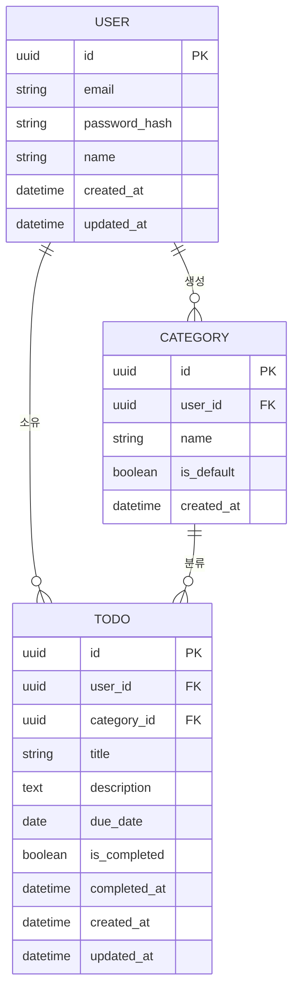
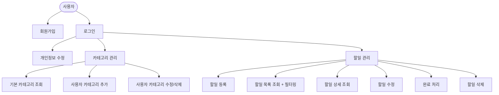

# 도메인 정의서 — TodoListApp

> 버전: 0.2
> 작성일: 2026-05-13
> 상태: 검토 전

---

## 1. 개요 / 비전

TodoListApp은 개인 사용자가 회원가입 후 인증된 계정 단위로 할일(Todo)을 등록·관리할 수 있는 웹 애플리케이션이다. 사용자별 데이터 격리와 카테고리 기반 분류를 핵심 가치로 삼는다.

---

## 2. 문제 정의 (Problem Statement)

| # | 문제 | 영향 |
|---|------|------|
| 1 | 할일 데이터가 인증된 사용자 단위로 격리되지 않는 기존 도구의 부재 | 개인 데이터 혼재, 보안 우려 |
| 2 | 카테고리 기반으로 할일을 분류할 수 있는 앱의 부재 | 할일 관리 체계 부족 |
| 3 | 기간·완료 여부 등 다차원 필터링 지원 미흡 | 우선순위 파악 어려움 |

---

## 3. 핵심 사용자 (Target Users / Persona)

| 구분 | 설명 |
|------|------|
| 일반 사용자 | 회원가입 후 자신의 할일을 등록·조회·수정·삭제하는 개인 사용자 |

> 초기 범위에서는 관리자(Admin) 역할을 별도 정의하지 않는다.

---

## 4. 주요 기능 요약 (Key Features)

1. **회원 관리** — 회원가입, 로그인/로그아웃, 개인정보 수정
2. **할일 관리** — 할일 등록·조회·수정·삭제 (CRUD)
3. **카테고리 관리** — 기본 카테고리 제공 + 사용자 정의 카테고리 추가/수정/삭제
4. **필터링** — 카테고리별 / 종료예정일 기간별 / 완료 여부별 복합 필터

---

## 5. 핵심 도메인 모델 / 엔티티

### 5.1 엔티티 정의

#### User (사용자)

| 속성 | 타입 | 설명 |
|------|------|------|
| id | UUID (PK) | 고유 식별자 |
| email | String (Unique) | 로그인 ID |
| password_hash | String | 암호화된 비밀번호 |
| name | String | 표시 이름 |
| created_at | Datetime | 가입일시 |
| updated_at | Datetime | 최종 수정일시 |

#### Category (카테고리)

| 속성 | 타입 | 설명 |
|------|------|------|
| id | UUID (PK) | 고유 식별자 |
| user_id | UUID (FK, nullable) | null이면 기본 카테고리 |
| name | String | 카테고리명 |
| is_default | Boolean | 기본 카테고리 여부 |
| created_at | Datetime | 생성일시 |

#### Todo (할일)

| 속성 | 타입 | 설명 |
|------|------|------|
| id | UUID (PK) | 고유 식별자 |
| user_id | UUID (FK) | 소유 사용자 |
| category_id | UUID (FK) | 분류 카테고리 |
| title | String | 할일 제목 |
| description | Text (nullable) | 상세 설명 |
| due_date | Date (nullable) | 종료예정일 |
| is_completed | Boolean | 완료 여부 (기본값: false) |
| completed_at | Datetime (nullable) | 완료 처리 일시 |
| created_at | Datetime | 등록일시 |
| updated_at | Datetime | 최종 수정일시 |

### 5.2 엔티티 관계

---

## 6. 비즈니스 규칙 (Business Rules)

### 사용자

- BR-U1: 이메일은 시스템 전체에서 유일해야 한다.
- BR-U2: 비밀번호는 저장 시 반드시 단방향 암호화(Hash)되어야 한다.
- BR-U3: 사용자는 자신의 데이터(할일, 카테고리)에만 접근할 수 있다.
- BR-U4: 회원 탈퇴 시 사용자 본인의 모든 데이터(할일, 사용자 정의 카테고리)는 즉시 하드 삭제된다. 복구 불가. (기본 카테고리는 user_id IS NULL이므로 영향 없음.)

### 카테고리

- BR-C1: 기본 카테고리(`is_default = true`)는 수정 및 삭제할 수 없다.
- BR-C2: 기본 카테고리는 모든 사용자에게 공통으로 제공된다 (`user_id = null`).
- BR-C3: 사용자 정의 카테고리는 해당 사용자만 조회·수정·삭제할 수 있다.
- BR-C4: 카테고리 삭제 시, 해당 카테고리에 속한 할일이 존재하면 삭제할 수 없다. (또는 기본 카테고리로 재분류 후 삭제 — 구현 시 결정)

### 할일

- BR-T1: 할일은 반드시 특정 사용자에 귀속되어야 한다 (`user_id` 필수).
- BR-T2: 할일은 반드시 하나의 카테고리에 속해야 한다 (`category_id` 필수).
- BR-T3: 완료 처리 시 `completed_at` 이 자동 기록된다.
- BR-T4: 이미 완료된 할일도 수정(제목, 설명, 카테고리 등)은 허용한다.
- BR-T5: `due_date`는 과거 날짜로도 등록 가능하다 (기간 초과 할일 추적 목적).

---

## 7. 유스케이스 / 사용자 시나리오

### 주요 시나리오 흐름

#### UC-01: 할일 등록
1. 로그인한 사용자가 할일 등록 화면으로 이동한다.
2. 제목(필수), 설명(선택), 종료예정일(선택), 카테고리(필수)를 입력한다.
3. 저장 시 할일이 해당 사용자에 귀속되어 DB에 저장된다.

#### UC-02: 할일 목록 조회 및 필터링
1. 로그인한 사용자가 할일 목록 화면으로 이동한다.
2. 카테고리 / 종료예정일 기간 / 완료 여부 필터를 선택한다.
3. 조건에 맞는 자신의 할일 목록이 표시된다.

#### UC-03: 카테고리 추가
1. 로그인한 사용자가 카테고리 관리 화면으로 이동한다.
2. 새 카테고리명을 입력하고 저장한다.
3. 이후 할일 등록 시 해당 카테고리를 선택할 수 있다.

---

## 8. 범위 (Scope)

### In Scope

- 회원가입 / 로그인 / 로그아웃 / 개인정보 수정
- 할일 CRUD (제목, 설명, 종료예정일, 카테고리, 완료 여부)
- 카테고리 관리 (기본 카테고리 + 사용자 정의 카테고리)
- 할일 목록 필터링 (카테고리, 기간, 완료 여부)
- 사용자별 데이터 격리

### Out of Scope (현재 버전 제외)

- 소셜 로그인 (OAuth)
- 할일 공유 / 협업 기능
- 알림 / 리마인더 기능
- 모바일 네이티브 앱
- 관리자 콘솔
- 할일 하위 항목(Sub-task) 구조
- 파일 첨부 기능

---

## 9. 변경 이력

| 버전 | 날짜 | 변경 내용 |
|------|------|---------|
| v0.1 | 2026-05-12 | 초안 작성 |
| v0.2 | 2026-05-13 | BR-U4 추가 (회원 탈퇴 시 하드 삭제) |
