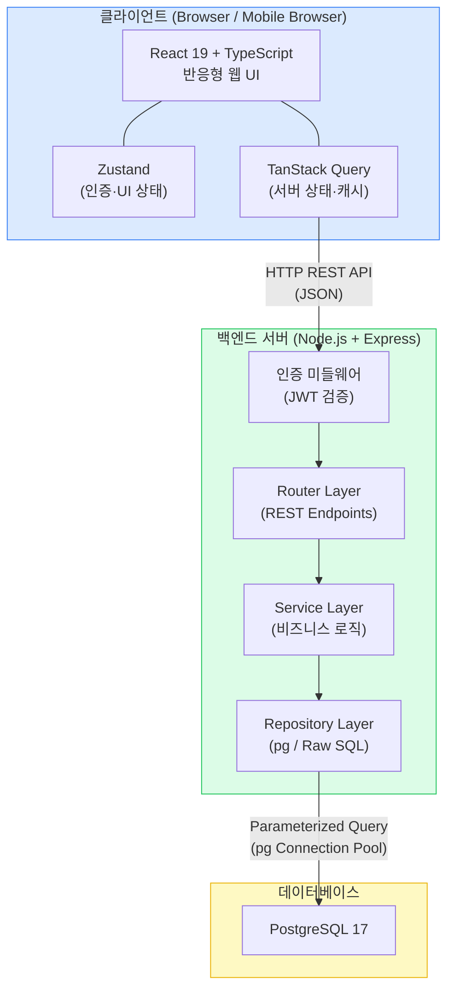
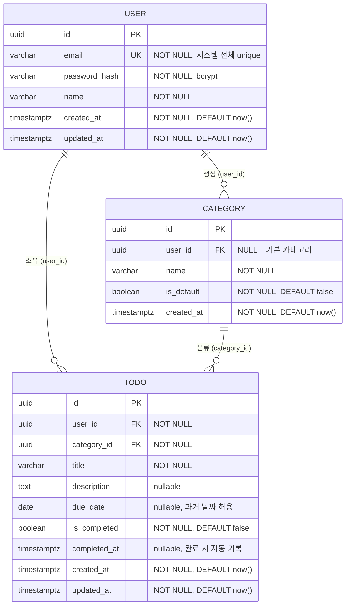

# PRD (Product Requirements Document) — TodoListApp

> **버전:** 1.2
> **작성일:** 2026-05-13
> **작성자:** Business Analyst (kjb980@kjbank.com)
> **검토자:** 미정
> **상태:** 초안 (Draft)

---

## 목차

1. [개요](#1-개요)
2. [배경 및 문제 정의](#2-배경-및-문제-정의)
3. [목표 및 성공 지표](#3-목표-및-성공-지표)
4. [타겟 사용자 / 페르소나](#4-타겟-사용자--페르소나)
5. [범위 정의](#5-범위-정의)
6. [기능 요구사항](#6-기능-요구사항)
7. [비기능 요구사항](#7-비기능-요구사항)
8. [기술 아키텍처 개요](#8-기술-아키텍처-개요)
9. [UI/UX 요구사항](#9-uiux-요구사항)
10. [데이터 모델](#10-데이터-모델)
11. [마일스톤 / 일정](#11-마일스톤--일정)
12. [리스크 및 가정사항](#12-리스크-및-가정사항)
13. [미결 사항](#13-미결-사항)
14. [향후 확장 계획](#14-향후-확장-계획)
15. [변경 이력](#15-변경-이력)

---

## 1. 개요

| 항목 | 내용 |
|------|------|
| **제품명** | TodoListApp |
| **목적** | 인증된 개인 사용자가 할일을 체계적으로 등록·분류·관리할 수 있는 웹 애플리케이션 제공 |
| **비전** | 할일 관리를 가장 단순하고 믿을 수 있는 방식으로 — 내 데이터는 오직 나만 본다 |
| **한 줄 설명** | 카테고리 기반 필터링과 사용자별 완전한 데이터 격리를 갖춘 개인용 할일 관리 서비스 |
| **플랫폼** | 반응형 웹 (Web + Mobile Web 단일 코드베이스) |
| **MVP 출시 목표** | 2026-05-16 (작성 기준 3일 후) |

---

## 2. 배경 및 문제 정의

도메인 정의서(1-domain-definition.md)의 문제 분석을 바탕으로, PRD 관점에서 사용자 가치 중심으로 재구성한다.

### 2.1 시장 맥락

기존 Todo 애플리케이션은 기능 과잉(협업, 프로젝트 관리 등)이거나, 반대로 단순 메모 수준에 머물러 있다. 20~50대 직장인이 일상에서 가볍게 쓸 수 있는, **인증 기반 개인 데이터 격리**와 **카테고리 분류**를 갖춘 미들 레인지 제품이 부재하다.

### 2.2 해결해야 할 핵심 문제

| ID | 문제 | 사용자 불편 | 해결 방향 |
|----|------|------------|----------|
| P-1 | 로그인 없이 공유되는 할일 데이터 — 개인정보 혼재 우려 | 신뢰할 수 없는 도구 사용 기피 | 계정 단위 데이터 격리 (JWT 인증, user_id 기반 쿼리 격리) |
| P-2 | 카테고리 없이 목록만 쌓이는 구조 — 맥락 파악 불가 | 우선순위 관리 불가 | 기본 + 사용자 정의 카테고리 제공 |
| P-3 | 완료 여부·기간·카테고리 기반의 복합 필터링 미지원 | 중요한 할일 누락 | 다차원 복합 필터 기능 |

### 2.3 제품이 제공하는 핵심 가치

- **신뢰** — 내 할일은 오직 내 계정에서만 보인다
- **체계** — 카테고리로 분류하고, 필터로 빠르게 탐색한다
- **단순함** — 불필요한 기능 없이 할일 관리 본질에 집중한다

---

## 3. 목표 및 성공 지표

> 소규모 개인 프로젝트 맥락에 맞는 현실적 지표를 설정한다.

### 3.1 정성적 목표

- 20~50대 직장인이 별도 튜토리얼 없이 3분 이내 첫 할일을 등록할 수 있다
- "내 데이터가 안전하다"는 신뢰감을 사용자가 느낀다
- 데스크톱·모바일 모두 동일하게 쾌적한 사용 경험을 제공한다

### 3.2 정량적 목표 및 KPI

| KPI | 목표값 | 측정 방법 |
|-----|--------|----------|
| MVP 기능 완성률 | 100% (FR Must 항목 전체) | 기능 체크리스트 |
| 신규 가입 후 첫 할일 등록 전환율 | ≥ 70% | 가입~첫 Todo 생성 이벤트 추적 |
| API 응답 P95 | < 500ms | 서버 로그 / 모니터링 |
| 동시접속 부하 처리 | 300명 이상 오류 없음 | 부하 테스트 (Apache JMeter 등) |
| 치명적 버그(P0) 출시 후 24시간 내 처리율 | 100% | 이슈 트래커 |
| 할일 완료 처리 성공률 | ≥ 99.9% | DB 트랜잭션 성공 로그 |

---

## 4. 타겟 사용자 / 페르소나

### 페르소나 A — 바쁜 직장인 "김민준" (32세, 마케터)

| 항목 | 내용 |
|------|------|
| **직업** | 대기업 마케팅팀 |
| **기기 사용 패턴** | 출근 전 모바일로 당일 할일 확인, 점심·퇴근 후 데스크톱에서 정리 |
| **주요 Pain Point** | 업무·개인 할일이 섞여 우선순위 파악 불가, 현재 사용하는 앱이 너무 복잡함 |
| **기대하는 것** | 카테고리로 업무/개인 분리, 어디서든 같은 화면 경험 |
| **기술 친숙도** | 중간 — 직관적 UI 필요 |

### 페르소나 B — 자기계발 중인 직장인 "박지연" (42세, 팀장)

| 항목 | 내용 |
|------|------|
| **직업** | IT 기업 팀장 |
| **기기 사용 패턴** | 주로 데스크톱, 출장 시 모바일 |
| **주요 Pain Point** | 여러 앱에 흩어진 할일, 기간 지난 항목 추적이 안 됨 |
| **기대하는 것** | 종료예정일 기반 필터로 마감 임박 할일 빠르게 파악, 계정 보안 |
| **기술 친숙도** | 높음 — 효율성 우선 |

---

## 5. 범위 정의

### 5.1 MVP In Scope (1차 릴리즈)

- 회원가입 / 로그인(JWT) / 로그아웃
- 개인정보 수정 (이름, 비밀번호)
- 회원 탈퇴 (사용자 데이터 즉시 하드 삭제)
- 할일 등록 / 조회 / 수정 / 삭제
- 할일 완료 처리 / 완료 취소
- 할일 목록 복합 필터링 (카테고리 / 종료예정일 기간 / 완료 여부)
- 카테고리 관리 (기본 카테고리 조회 + 사용자 정의 카테고리 CRUD)
- 반응형 웹 UI (Web + Mobile Web)

### 5.2 Out of Scope (현재 버전 제외)

| 항목 | 제외 사유 | 계획 버전 |
|------|----------|----------|
| OAuth Social Login (Google, Facebook 등) | 인증 복잡도 증가, 3일 일정 불가 | 2차 |
| 다크모드 | UI 추가 작업 비용 | 2차 |
| 다국어 지원 (i18n) | 콘텐츠 번역 리소스 필요 | 2차 |
| 알림 / 리마인더 | 외부 서비스 연동 필요 | 2차 |
| 할일 공유 / 협업 기능 | 멀티유저 데이터 모델 변경 필요 | 미정 |
| 모바일 네이티브 앱 (iOS/Android) | 반응형 웹으로 대체 | 미정 |
| 관리자 콘솔 | 개인 프로젝트 범위 초과 | 미정 |
| 할일 하위 항목(Sub-task) | 도메인 모델 확장 필요 | 미정 |
| 파일 첨부 기능 | 스토리지 인프라 필요 | 미정 |

---

## 6. 기능 요구사항

### 우선순위 정의

| 등급 | 의미 |
|------|------|
| **Must** | MVP 필수. 없으면 출시 불가 |
| **Should** | 강력 권장. 가능하면 1차 포함 |
| **Could** | 여유 시 포함. 없어도 출시 가능 |

### 6.1 도메인 정의서 UC → FR 추적 매핑

| UC ID | UC 명칭 | FR ID(s) |
|-------|--------|----------|
| UC-01 | 할일 등록 | FR-07 |
| UC-02 | 할일 목록 조회 및 필터링 | FR-08, FR-09 |
| UC-03 | 카테고리 추가 | FR-14 |
| — (도메인 정의서 기능 목록) | 회원가입 | FR-01 |
| — | 로그인/로그아웃 | FR-02, FR-03 |
| — | 개인정보 수정 | FR-04 |
| — | 회원 탈퇴 | FR-05 |
| — | 할일 상세 조회 | FR-10 |
| — | 할일 수정 | FR-11 |
| — | 할일 완료/취소 처리 | FR-12 |
| — | 할일 삭제 | FR-13 |
| — | 카테고리 조회 | FR-15 |
| — | 사용자 카테고리 수정 | FR-16 |
| — | 사용자 카테고리 삭제 | FR-17 |

### 6.2 기능 요구사항 상세

#### [회원 관리]

| FR ID | 기능명 | 설명 | 관련 BR | 우선순위 |
|-------|--------|------|--------|--------|
| FR-01 | 회원가입 | 이메일(unique), 비밀번호, 이름 입력 후 계정 생성. 이메일 중복 시 오류 반환. | BR-U1, BR-U2 | Must |
| FR-02 | 로그인 | 이메일 + 비밀번호 검증 후 JWT Access Token 발급. 발급된 토큰은 클라이언트의 Zustand 인메모리 스토어(`useAuthStore`)에 저장된다 (localStorage/sessionStorage/Cookie 사용 금지). | BR-U2 | Must |
| FR-03 | 로그아웃 | Zustand 인메모리 스토어(`useAuthStore`)의 토큰 필드 초기화로 세션 종료. | — | Must |
| FR-04 | 개인정보 수정 | 이름 및 비밀번호 변경 가능. 비밀번호 변경 시 현재 비밀번호 확인 필요. | BR-U2 | Must |
| FR-05 | 회원 탈퇴 | 계정 및 연관 데이터(할일, 사용자 정의 카테고리) 즉시 하드 삭제. 복구 불가. | BR-U3 | Must |
| FR-06 | 인증 보호 | 로그인 없이 할일/카테고리 API 접근 시 401 반환. | BR-U3 | Must |

#### [할일 관리]

| FR ID | 기능명 | 설명 | 관련 BR | 우선순위 |
|-------|--------|------|--------|--------|
| FR-07 | 할일 등록 | 제목(필수), 설명(선택), 종료예정일(선택), 카테고리(필수) 입력 후 저장. 과거 날짜 due_date 허용. | BR-T1, BR-T2, BR-T5 | Must |
| FR-08 | 할일 목록 조회 | 로그인 사용자의 할일 목록 반환. 기본 정렬: 생성일 내림차순. | BR-T1, BR-U3 | Must |
| FR-09 | 할일 복합 필터링 | 카테고리 / 종료예정일 기간(from~to) / 완료 여부(전체/완료/미완료) 조합 필터 지원. | — | Must |
| FR-10 | 할일 상세 조회 | 특정 할일의 전체 필드 조회. 본인 할일만 접근 가능. | BR-U3 | Should |
| FR-11 | 할일 수정 | 제목, 설명, 종료예정일, 카테고리 수정 가능. 완료된 할일도 수정 허용. | BR-T4 | Must |
| FR-12 | 할일 완료/취소 처리 | 완료 처리 시 is_completed=true, completed_at 자동 기록. 완료 취소 시 completed_at null 처리. | BR-T3 | Must |
| FR-13 | 할일 삭제 | 할일 영구 삭제. 본인 할일만 삭제 가능. | BR-U3 | Must |

#### [카테고리 관리]

| FR ID | 기능명 | 설명 | 관련 BR | 우선순위 |
|-------|--------|------|--------|--------|
| FR-14 | 사용자 카테고리 추가 | 카테고리명 입력 후 저장. 동일 사용자 내 중복 카테고리명 불가. | BR-C3 | Must |
| FR-15 | 카테고리 목록 조회 | 기본 카테고리(is_default=true) + 해당 사용자 정의 카테고리 목록 반환. | BR-C1, BR-C2 | Must |
| FR-16 | 사용자 카테고리 수정 | 사용자 정의 카테고리명 수정. 기본 카테고리 수정 불가. | BR-C1, BR-C3 | Should |
| FR-17 | 사용자 카테고리 삭제 | 사용자 정의 카테고리 삭제. 기본 카테고리 삭제 불가. 해당 카테고리에 할일이 존재할 경우 삭제 거부 또는 기본 카테고리로 재분류 후 삭제 (구현 시 결정 — Open Issue OI-01). | BR-C1, BR-C4 | Should |

---

## 7. 비기능 요구사항

### 7.1 성능 (Performance)

| 항목 | 요구사항 | 비고 |
|------|---------|------|
| 동시접속 처리 | 300명 동시접속 시 정상 응답 | Node.js 단일 인스턴스 기준 |
| API 응답시간 (P95) | < 500ms | 단순 CRUD 기준 |
| API 응답시간 (P99) | < 1,000ms | 복합 필터 포함 |
| 페이지 초기 로딩 (FCP) | < 2초 | 3G 기준 |

### 7.2 보안 (Security)

| 항목 | 요구사항 |
|------|---------|
| 인증 방식 | JWT (Access Token). Refresh Token은 2차 확장 시 검토. |
| Access Token 유효기간 | **1시간 (확정)**, .env로 조정 가능 |
| 비밀번호 저장 | bcrypt, cost factor ≥ 12 |
| 전송 보안 | HTTPS 강제 (운영 환경) |
| 데이터 격리 | 모든 DB 쿼리에 user_id 조건 필수. 타 사용자 데이터 접근 시 403 반환. |
| 입력값 검증 | 서버 사이드 유효성 검사 필수 (클라이언트 검사는 보조적 역할) |
| SQL Injection 방지 | pg 라이브러리의 Parameterized Query 사용 (ORM 사용 금지) |
| 토큰 저장 위치 (클라이언트) | **Zustand 인메모리 스토어** (`useAuthStore`). localStorage / sessionStorage / Cookie(HTTP Only 포함) 사용 금지. 새로고침 시 메모리 휘발 → 재로그인 필요. axios 인터셉터가 메모리 스토어에서 토큰을 읽어 `Authorization: Bearer <token>` 헤더로 전달. 선택 근거: XSS 노출 범위를 메모리로 한정(페이지 닫으면 즉시 소멸), localStorage 대비 안전, HTTP Only Cookie 대비 CSRF 대응 부담 없음, 3일 MVP 일정에 가장 단순한 구현. |

### 7.3 가용성 및 확장성 (Availability & Scalability)

| 항목 | 요구사항 |
|------|---------|
| 목표 가용성 | 99% 이상 (개인 프로젝트 현실적 목표) |
| 스케일 아웃 대비 | Stateless API 설계 (JWT로 서버 상태 미보관) |
| DB 연결 관리 | pg Connection Pool 설정 (max: 20 권장) |

### 7.4 데이터 보존 (Data Retention)

| 항목 | 정책 |
|------|------|
| 회원 탈퇴 시 | User, Todo, 사용자 정의 Category 즉시 하드 삭제 (복구 불가, 소프트 삭제 없음) |
| 기본 카테고리 | 시스템 관리 데이터 — 탈퇴 시 영향 없음 |
| 할일 삭제 | 즉시 하드 삭제 |

### 7.5 유지보수성 (Maintainability)

| 항목 | 요구사항 |
|------|---------|
| 코드 구조 | 프론트엔드: Feature 기반 폴더 구조. 백엔드: MVC 또는 Router-Service-Repository 레이어 분리 |
| 환경 설정 | .env 파일로 DB 연결 정보, JWT 시크릿, 토큰 만료시간 관리 |
| 로깅 | API 요청/응답 및 에러 로그 콘솔 출력 (최소한의 운영 가시성 확보) |

---

## 8. 기술 아키텍처 개요

### 8.1 기술 스택

| 레이어 | 기술 | 버전 | 비고 |
|--------|------|------|------|
| 프론트엔드 | React | 19 | |
| 프론트엔드 | TypeScript | 5.x | |
| 빌드 도구 | Vite | 5.x | React 개발/빌드 환경 |
| 프론트엔드 상태관리 | Zustand | 5.x | 전역 인증 상태(JWT 메모리 저장 `useAuthStore`), UI 상태 |
| 프론트엔드 서버 상태 | TanStack Query | 5.x | API 캐싱, 동기화 |
| HTTP 클라이언트 | axios | 1.x | API 호출 (또는 fetch wrapper 대체 가능) |
| 입력 검증 | zod | 3.x | 클라이언트·서버 사이드 스키마 검증 |
| 백엔드 | Node.js + Express | LTS | REST API |
| DB 드라이버 | pg (node-postgres) | 8.x | **ORM 사용 금지** — Raw SQL + Parameterized Query만 사용 |
| 데이터베이스 | PostgreSQL | 17 | |
| 인증 | JWT | — | jsonwebtoken 라이브러리 |
| 비밀번호 해시 | bcrypt | — | cost factor ≥ 12 |
| 정적 분석 | ESLint + Prettier | 최신 메이저 | 코드 품질·포맷팅 |

> **중요 제약사항:** 백엔드의 PostgreSQL 연동은 반드시 `pg` 라이브러리를 직접 사용한다. Prisma, TypeORM, Sequelize 등 ORM/Query Builder 도입을 금지한다. 모든 쿼리는 SQL 문자열 + Parameterized Query ($1, $2, ...) 방식으로 작성한다.

### 8.2 시스템 아키텍처 다이어그램

### 8.3 주요 API 엔드포인트 목록

| 메서드 | 경로 | 설명 | 인증 필요 | FR ID |
|--------|------|------|----------|-------|
| POST | /api/auth/register | 회원가입 | No | FR-01 |
| POST | /api/auth/login | 로그인 (JWT 발급) | No | FR-02 |
| POST | /api/auth/logout | 로그아웃 | Yes | FR-03 |
| GET | /api/users/me | 내 정보 조회 | Yes | FR-04 |
| PATCH | /api/users/me | 개인정보 수정 | Yes | FR-04 |
| DELETE | /api/users/me | 회원 탈퇴 | Yes | FR-05 |
| GET | /api/todos | 할일 목록 조회 (필터 쿼리 파라미터 지원) | Yes | FR-08, FR-09 |
| POST | /api/todos | 할일 등록 | Yes | FR-07 |
| GET | /api/todos/:id | 할일 상세 조회 | Yes | FR-10 |
| PATCH | /api/todos/:id | 할일 수정 | Yes | FR-11 |
| PATCH | /api/todos/:id/complete | 완료/취소 처리 | Yes | FR-12 |
| DELETE | /api/todos/:id | 할일 삭제 | Yes | FR-13 |
| GET | /api/categories | 카테고리 목록 조회 | Yes | FR-15 |
| POST | /api/categories | 사용자 카테고리 추가 | Yes | FR-14 |
| PATCH | /api/categories/:id | 사용자 카테고리 수정 | Yes | FR-16 |
| DELETE | /api/categories/:id | 사용자 카테고리 삭제 | Yes | FR-17 |

> **필터 쿼리 파라미터 (GET /api/todos):** `category_id`, `due_date_from`, `due_date_to`, `is_completed`

---

## 9. UI/UX 요구사항

### 9.1 반응형 웹 Breakpoint 가이드

| 구분 | Breakpoint | 대상 기기 |
|------|-----------|---------|
| Mobile | < 768px | 스마트폰 |
| Tablet | 768px ~ 1023px | 태블릿 |
| Desktop | ≥ 1024px | 데스크톱 / 랩톱 |

> 단일 React 코드베이스에서 CSS Media Query (또는 Tailwind CSS의 반응형 유틸리티) 활용. 모바일 퍼스트 접근 권장.

### 9.2 주요 화면 목록

| 화면 ID | 화면명 | 주요 구성 요소 | 접근 조건 |
|--------|--------|-------------|---------|
| SCR-01 | 로그인 화면 | 이메일·비밀번호 입력폼, 로그인 버튼, 회원가입 링크 | 비로그인 |
| SCR-02 | 회원가입 화면 | 이름·이메일·비밀번호 입력폼, 유효성 오류 표시 | 비로그인 |
| SCR-03 | 할일 목록 화면 | 필터 바, 할일 카드 리스트, 등록 버튼, 완료 토글 | 로그인 |
| SCR-04 | 할일 등록/수정 모달 | 제목·설명·종료예정일·카테고리 입력, 저장/취소 버튼 | 로그인 |
| SCR-05 | 카테고리 관리 화면 | 기본 카테고리 목록(수정불가), 사용자 카테고리 CRUD | 로그인 |
| SCR-06 | 마이페이지 화면 | 이름·비밀번호 수정폼, 회원 탈퇴 버튼(확인 다이얼로그) | 로그인 |

### 9.3 UX 원칙

- 할일 완료 처리는 목록 화면에서 토글 클릭 한 번으로 가능해야 한다 (최소 조작)
- 비밀번호 입력 필드는 show/hide 토글 제공
- 회원 탈퇴 버튼은 확인 다이얼로그(문구 직접 입력 방식 또는 2-step 확인) 필수
- 필터 조건 변경 시 즉시 목록 갱신 (TanStack Query 연동)
- 에러 메시지는 사용자 친화적 문구로 제공 (기술 오류 코드 노출 금지)

### 9.4 다크모드 / 다국어 (Out of Scope — 2차 예정)

1차 릴리즈는 라이트모드 단일, 한국어 단일로 출시한다. 2차에서 다크모드(CSS 변수 기반 테마 설계 권장)와 i18n(react-i18next 등) 확장을 진행한다.

---

## 10. 데이터 모델

도메인 정의서(5장)의 ER 다이어그램을 기반으로, PRD 관점의 제약 조건 및 인덱스 전략을 보강한다.

### 10.1 ERD

### 10.2 인덱스 전략 (권장)

| 테이블 | 인덱스 컬럼 | 목적 |
|--------|-----------|------|
| users | email | 로그인 시 빠른 조회 |
| todos | user_id | 사용자별 목록 조회 |
| todos | user_id, is_completed | 완료 여부 필터 |
| todos | user_id, due_date | 기간 필터 |
| todos | category_id | 카테고리별 할일 존재 여부 확인 (삭제 전 검사) |
| categories | user_id | 사용자 카테고리 목록 조회 |

### 10.3 외래키 ON DELETE 정책

| 테이블 | FK 컬럼 | 참조 | ON DELETE |
|--------|--------|------|----------|
| todos | user_id | users(id) | CASCADE — 회원 탈퇴 시 할일 자동 삭제 |
| todos | category_id | categories(id) | RESTRICT (또는 OI-01 정책에 따라 SET NULL → 기본 카테고리 재분류) |
| categories | user_id | users(id) | CASCADE — 회원 탈퇴 시 사용자 카테고리 자동 삭제 (기본 카테고리는 user_id IS NULL이므로 영향 없음) |

> 회원 탈퇴 시 트랜잭션 내에서 CASCADE로 todos와 categories가 자동 정리된다 (PRD 7.4 데이터 보존 정책 충족). R-05 리스크 대응.

### 10.4 주요 데이터 규칙 요약

| 규칙 ID | 내용 |
|--------|------|
| BR-U1 | users.email UNIQUE 제약 |
| BR-U2 | password_hash는 bcrypt 해시값만 저장 |
| BR-U3 | 모든 Todo/Category 쿼리에 WHERE user_id = $1 필수 |
| BR-C1 | is_default=true인 Category는 UPDATE/DELETE 금지 (서비스 레이어에서 검증) |
| BR-C2 | 기본 카테고리: user_id IS NULL |
| BR-C4 | Category 삭제 전 연결된 Todo 존재 여부 검사 (OI-01 참조) |
| BR-T3 | 완료 처리 시 completed_at = NOW() 자동 설정 |
| BR-T5 | due_date에 과거 날짜 허용 (CHECK 제약 없음) |

---

## 11. 마일스톤 / 일정

> 총 개발 기간: **3일** (2026-05-13 ~ 2026-05-15, 출시 목표 2026-05-16)
> 1인 개발 가정. 일정이 매우 타이트하므로 작업 순서와 우선순위 엄수 필요.

### 11.1 Day-by-Day 작업 분배 (권장)

#### Day 1 (2026-05-13) — 기반 구축

| 영역 | 작업 항목 |
|------|---------|
| 환경 설정 | 프로젝트 초기화 (React + Vite, Node.js + Express), PostgreSQL 17 DB 생성, .env 설정 |
| DB | 테이블 생성 SQL (users, categories, todos), 기본 카테고리 시드 데이터 |
| 백엔드 | pg Connection Pool 설정, Router-Service-Repository 구조 셋업 |
| 백엔드 | 인증 API 완성 (FR-01, FR-02, FR-03) — 회원가입, 로그인, JWT 발급 |
| 백엔드 | JWT 인증 미들웨어 구현 |
| 프론트엔드 | Zustand 인증 스토어, TanStack Query 클라이언트 설정 |
| 프론트엔드 | SCR-01 (로그인), SCR-02 (회원가입) 화면 구현 |

#### Day 2 (2026-05-14) — 핵심 기능 구현

| 영역 | 작업 항목 |
|------|---------|
| 백엔드 | 할일 CRUD API (FR-07~FR-13) — 등록, 목록 조회, 수정, 완료 처리, 삭제 |
| 백엔드 | 복합 필터 쿼리 구현 (category_id, due_date 범위, is_completed) |
| 백엔드 | 카테고리 API (FR-14~FR-17) |
| 프론트엔드 | SCR-03 (할일 목록 + 필터 바) 구현 |
| 프론트엔드 | SCR-04 (할일 등록/수정 모달) 구현 |
| 프론트엔드 | 할일 완료 토글 UI 연동 |

#### Day 3 (2026-05-15) — 마무리 및 검증

| 영역 | 작업 항목 |
|------|---------|
| 백엔드 | 개인정보 수정, 회원 탈퇴(하드 삭제) API (FR-04, FR-05) |
| 프론트엔드 | SCR-05 (카테고리 관리), SCR-06 (마이페이지) 구현 |
| 프론트엔드 | 반응형 UI 검증 (Mobile / Desktop 기준) |
| QA | Must 기능 전체 수동 테스트, 치명적 버그 수정 |
| 배포 | 운영 환경 배포 및 동작 최종 확인 |

### 11.2 기능 우선순위 절충안 (일정 위기 시)

3일 안에 모든 Should 항목까지 완성이 어려울 경우 아래 순서로 후순위 이동을 권장한다.

| 후순위 권장 기능 | FR ID | 이유 |
|--------------|-------|------|
| 할일 상세 조회 별도 화면 | FR-10 | 목록 화면에서 대부분 정보 확인 가능 |
| 사용자 카테고리 수정 | FR-16 | 삭제 후 재생성으로 대체 가능 |
| 사용자 카테고리 삭제 | FR-17 | 할일 재분류 정책 결정 필요 (OI-01) |
| 완료 취소 (Undo 완료) | FR-12 일부 | 완료 처리만 먼저 구현 가능 |

---

## 12. 리스크 및 가정사항

### 12.1 리스크 등록부

| ID | 리스크 | 발생 가능성 | 영향도 | 완화 방안 |
|----|--------|-----------|-------|---------|
| R-01 | **3일 일정 초과** — Should 기능 미완성 | 높음 | 중간 | Day 3 오전에 Must 기능 완성 여부 점검. 미완성 Should는 명시적으로 Out of Scope 처리 후 출시 |
| R-02 | pg Raw SQL 복잡도로 인한 쿼리 오류 | 중간 | 높음 | 복합 필터 쿼리는 Day 2 최우선 작업. 동적 SQL 빌더 유틸 함수를 초기에 작성 |
| R-03 | 반응형 UI 구현 시간 부족 | 중간 | 중간 | Mobile-first CSS 작성 습관. 데스크톱 레이아웃은 미디어 쿼리 보완 방식으로 최소화 |
| R-04 | JWT 보안 설정 누락 (시크릿 노출 등) | 낮음 | 높음 | .env에 JWT_SECRET 분리, .gitignore 확인, 코드 리뷰 체크리스트에 포함 |
| R-05 | 회원 탈퇴 하드 삭제 CASCADE 미설정 | 낮음 | 높음 | DB 스키마에 ON DELETE CASCADE 명시적 정의. Day 1 DB 설계 시 검증 |
| R-06 | 동시접속 300명 부하 미달 | 낮음 | 중간 | pg Connection Pool max 값 튜닝, Express 비동기 처리 검토. 출시 전 기본 부하 테스트 권장 |

### 12.2 가정사항

- 1인 개발자가 풀스택 개발을 수행한다
- 배포 인프라(서버, 도메인, PostgreSQL 호스팅)는 사전에 준비된 상태이다
- 기본 카테고리의 종류와 초기값은 구현 시 개발자가 결정한다 (OI-02)
- 모든 텍스트 콘텐츠는 한국어 단일로 작성한다

---

## 13. 미결 사항

| ID | 미결 항목 | 의사결정 필요자 | 기한 |
|----|---------|--------------|------|
| OI-01 | 카테고리 삭제 시 할일 처리 정책: 삭제 거부 vs 기본 카테고리로 재분류 후 삭제 | 개발자 / 제품 오너 | Day 1 종료 전 |
| OI-02 | 기본 카테고리(is_default=true) 초기값 목록 결정 (예: 업무, 개인, 기타 등) | 개발자 / 제품 오너 | Day 1 종료 전 |
| OI-04 | 회원 탈퇴 확인 UX 방식: 문구 직접 입력(예: "탈퇴합니다") vs 2-step 확인 버튼 | 개발자 / UX | Day 2 종료 전 |
| OI-05 | 배포 인프라 스펙 및 환경 변수 목록 최종 확정 | 개발자 | Day 1 |

> OI-03(JWT TTL)은 1시간으로 확정되어 종결됨

---

## 14. 향후 확장 계획

| 항목 | 설명 | 예상 시점 |
|------|------|---------|
| OAuth Social Login | Google, Facebook 등 소셜 계정 연동. 현 JWT 구조에 추가 인증 전략으로 확장. | 2차 |
| Refresh Token | Access Token 만료 시 자동 갱신. 보안 강화. 현 정책은 인메모리 단일 Access Token. Refresh Token 도입 시 httpOnly Cookie 등 저장 전략 재검토. | 2차 |
| 다크모드 | CSS 변수 기반 테마 시스템 도입. 1차 개발 시 CSS 변수 사용 습관으로 2차 전환 비용 최소화 권장. | 2차 |
| 다국어 지원 (i18n) | react-i18next 등 도입. 영어 우선 확장. | 2차 |
| 알림 / 리마인더 | 마감 임박 할일 이메일 또는 브라우저 푸시 알림. | 3차 |
| 할일 공유 / 협업 | 특정 할일을 다른 사용자와 공유. 데이터 모델 확장 필요. | 미정 |
| 관리자 콘솔 | 전체 사용자 현황 모니터링, 기본 카테고리 관리. | 미정 |
| Sub-task (하위 할일) | 할일 내 체크리스트 구조. 도메인 모델 확장 필요. | 미정 |
| 파일 첨부 | 할일에 파일/이미지 첨부. S3 등 외부 스토리지 연동 필요. | 미정 |
| 모바일 네이티브 앱 | React Native 등을 통한 iOS/Android 앱. 현 REST API를 그대로 재사용 가능. | 미정 |

---

## 15. 변경 이력

| 버전 | 날짜 | 작성자 | 변경 내용 |
|------|------|--------|---------|
| 1.0 | 2026-05-13 | Business Analyst | 초안 작성 — 도메인 정의서 v0.1 기반, 사용자 요구사항 반영 |
| 1.1 | 2026-05-13 | Business Analyst | 기술 스택 보강(Vite·zod·axios·ESLint), JWT TTL 1시간 확정, ON DELETE 정책 명시, OI-03 종결 |
| 1.2 | 2026-05-13 | Business Analyst | JWT 토큰 클라이언트 저장 위치를 Zustand 인메모리(`useAuthStore`)로 확정 명시 (localStorage/sessionStorage/Cookie 금지). FR-02·FR-03·7.2 보안·8.1 기술 스택·14장 향후 확장에 반영 |

---

*본 문서는 도메인 정의서(1-domain-definition.md) v0.1을 기반으로 작성되었으며, 도메인 정의서 변경 시 본 PRD도 함께 업데이트되어야 한다.*
