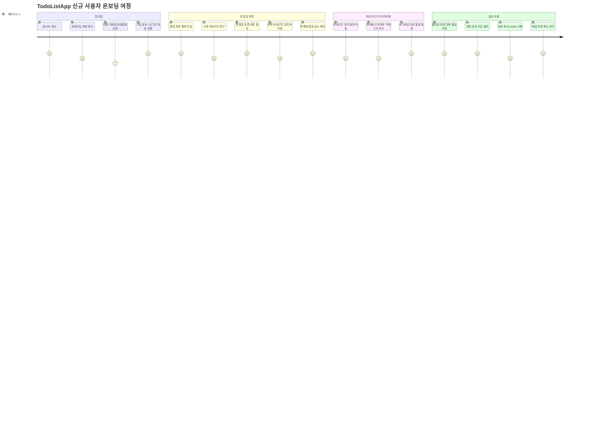
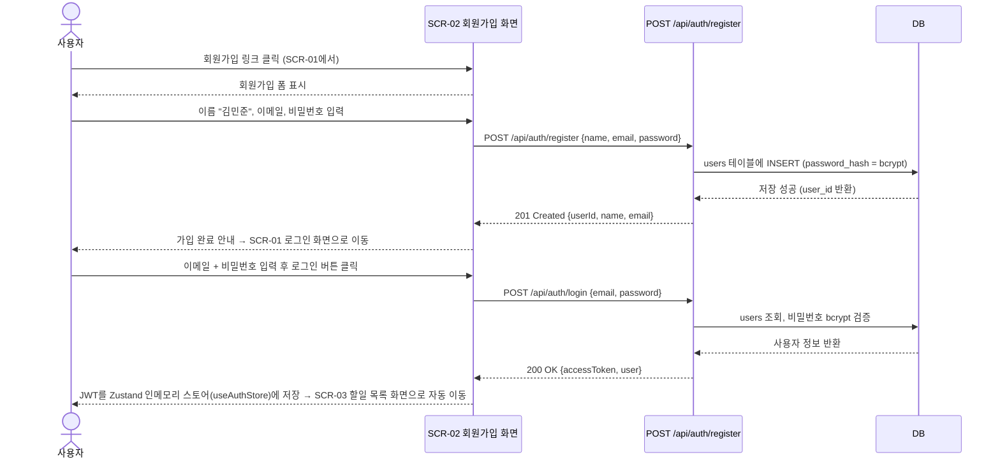

# 사용자 시나리오 (User Scenario) — TodoListApp

---

## 1. 문서 정보

| 항목 | 내용 |
|------|------|
| **버전** | 1.1 |
| **작성일** | 2026-05-13 |
| **작성자** | Business Analyst |
| **상태** | 초안 (Draft) |
| **기반 문서** | PRD v1.0 (`2-prd.md`), 도메인 정의서 v0.1 (`1-domain-definition.md`), UC 다이어그램 v1.0 (`99-uc.md`) |

### 변경 이력

| 버전 | 날짜 | 작성자 | 변경 내용 |
|------|------|--------|---------|
| 1.0 | 2026-05-13 | Business Analyst | 초안 작성 — PRD v1.0 기반, 15개 시나리오 정의 |
| 1.1 | 2026-05-13 | Business Analyst | JWT 메모리 저장 정책 명시 — SCN-01/SCN-13에 Zustand 인메모리 스토어(`useAuthStore`) 보관 및 새로고침 시 재로그인 흐름 반영 |

---

## 2. 개요

### 2.1 목적

본 문서는 TodoListApp을 실제로 사용하는 사용자의 관점에서 주요 기능 사용 흐름을 시나리오 단위로 기술한다. 각 시나리오는 특정 페르소나가 특정 상황(시간대, 기기, 동기)에서 시스템과 상호작용하는 과정을 단계별로 서술하며, 정상 흐름 외에 대안 흐름과 예외 흐름을 포함한다.

### 2.2 범위

- PRD v1.0의 MVP In Scope 기능 전체를 커버한다 (FR-01 ~ FR-17).
- 정상 흐름 시나리오 10개, 예외/엣지 시나리오 5개, 총 15개 시나리오를 정의한다.
- Out of Scope 기능(OAuth, 다크모드, 알림 등)은 본 문서에 포함하지 않는다.

### 2.3 활용 방안

| 활용 주체 | 활용 목적 |
|----------|---------|
| 개발자 | 기능 구현 시 사용자 기대 흐름 파악 및 엣지 케이스 사전 식별 |
| QA | 시나리오를 테스트 케이스로 직접 전환하여 검증 기준으로 활용 |
| 기획자 | 요구사항 완전성 검증 및 누락 흐름 발견 |
| 신규 팀원 | 시스템 전체 사용자 여정 빠르게 파악 |

---

## 3. 페르소나 요약

### 페르소나 A — 김민준 (32세, 마케터)

| 항목 | 내용 |
|------|------|
| **직업** | 대기업 마케팅팀 |
| **주요 기기** | 출근 전·이동 중: 모바일 / 점심·퇴근 후: 데스크톱 |
| **핵심 Pain Point** | 업무·개인 할일이 섞여 우선순위 파악 불가, 현재 앱이 너무 복잡함 |
| **기대** | 카테고리로 업무/개인 분리, 어디서든 동일한 화면 경험 |
| **기술 친숙도** | 중간 — 직관적 UI가 필요함 |
| **주요 사용 시간대** | 오전 8시(모바일), 점심 12시, 오후 6~7시(데스크톱) |

### 페르소나 B — 박지연 (42세, IT 기업 팀장)

| 항목 | 내용 |
|------|------|
| **직업** | IT 기업 팀장 |
| **주요 기기** | 주로 데스크톱, 출장 시 모바일 |
| **핵심 Pain Point** | 여러 앱에 흩어진 할일, 기간 지난 항목 추적이 안 됨 |
| **기대** | 종료예정일 기반 필터로 마감 임박 할일 빠르게 파악, 계정 보안 |
| **기술 친숙도** | 높음 — 효율성 우선 |
| **주요 사용 시간대** | 오전 9시(데스크톱 업무 시작), 퇴근 후 저녁(일정 정리) |

---

## 4. 시나리오 분류 체계

### 4.1 명명 규칙

| 규칙 | 형식 | 예시 |
|------|------|------|
| 시나리오 ID | `SCN-NN` (2자리 순번) | SCN-01, SCN-15 |
| 흐름 구분 | Main / Alternative-N / Exception-N | Main Flow, Alternative-1, Exception-2 |

### 4.2 흐름 유형 정의

| 유형 | 설명 |
|------|------|
| **정상 흐름 (Main Flow)** | 사용자가 의도한 목표를 오류 없이 달성하는 표준 경로 |
| **대안 흐름 (Alternative Flow)** | 정상 목표는 달성하지만 경로가 다른 경우 (예: 다른 입력 방식, 선택적 단계) |
| **예외 흐름 (Exception Flow)** | 오류, 제약 위반, 시스템 실패 등으로 정상 흐름이 중단되는 경우 |

### 4.3 시나리오 분류 현황

| 분류 | SCN ID 목록 |
|------|------------|
| 정상 흐름 (Main) | SCN-01 ~ SCN-10 |
| 예외/엣지 (Exception/Edge) | SCN-11 ~ SCN-15 |

---

## 5. 주요 사용자 여정 (User Journey Map)

신규 사용자가 서비스에 첫 진입하여 일상적으로 활용하기까지의 전체 여정을 시각화한다.

### 핵심 마일스톤별 관련 시나리오

| 여정 단계 | 관련 시나리오 |
|----------|------------|
| 첫 진입 — 가입·로그인 | SCN-01 |
| 첫 할일 등록 | SCN-02 |
| 카테고리 커스터마이징 | SCN-03, SCN-08 |
| 필터·조회 활용 | SCN-04 |
| 완료 처리·취소 | SCN-05 |
| 수정·삭제 | SCN-06, SCN-07 |
| 계정 관리 | SCN-09, SCN-10 |

---

## 6. 상세 시나리오

---

### SCN-01: 신규 사용자 회원가입 및 첫 로그인

| 항목 | 내용 |
|------|------|
| **시나리오 ID** | SCN-01 |
| **제목** | 신규 사용자 회원가입 및 첫 로그인 |
| **관련 UC** | UC-01 (회원가입), UC-02 (로그인) |
| **관련 FR** | FR-01, FR-02 |
| **관련 BR** | BR-U1, BR-U2 |
| **관련 화면** | SCR-02 (회원가입), SCR-01 (로그인), SCR-03 (할일 목록) |

**페르소나 및 컨텍스트**

| 항목 | 내용 |
|------|------|
| 페르소나 | A (김민준, 32세, 마케터) |
| 시간대 | 오전 8시, 지하철 출근 중 |
| 사용 기기 | 모바일 (스마트폰, Chrome 브라우저) |
| 동기 | 동료로부터 앱을 추천받아 출근길에 바로 가입해보기로 함 |

**사전 조건 (Precondition)**
- 사용자는 TodoListApp에 계정이 없다.
- 네트워크 연결 상태가 정상이다.

**트리거 (Trigger)**
- 사용자가 브라우저에서 TodoListApp URL을 처음 입력하여 접속한다.

**주요 흐름 (Main Flow)**

| 단계 | 사용자 행동 | 시스템 응답 |
|------|------------|-----------|
| 1 | 앱 URL 접속 → 비로그인 상태 감지 | SCR-01 로그인 화면으로 자동 리다이렉트 |
| 2 | "회원가입" 링크 클릭 | SCR-02 회원가입 화면 표시 |
| 3 | 이름, 이메일, 비밀번호 입력 | 클라이언트 측 실시간 유효성 표시 (형식 오류 시 인라인 안내) |
| 4 | "가입하기" 버튼 클릭 | POST /api/auth/register 호출. bcrypt 해시 처리 후 DB 저장 |
| 5 | — | 201 응답 반환. 가입 성공 메시지 표시 후 SCR-01로 이동 |
| 6 | 이메일 + 비밀번호 입력 후 로그인 | POST /api/auth/login 호출. JWT 발급 |
| 7 | — | 200 응답. JWT Access Token을 클라이언트의 **Zustand 인메모리 스토어**(`useAuthStore`)에 저장 (localStorage/sessionStorage/Cookie 사용 금지). SCR-03으로 이동 |

**대안 흐름 (Alternative Flow)**
- **Alternative-1 (이미 계정 보유):** 사용자가 SCR-01에서 로그인 정보를 바로 입력 → 단계 6~7로 진행.

**예외 흐름 (Exception Flow)**
- **Exception-1 (중복 이메일):** 서버가 409 Conflict 반환 → SCR-02에서 "이미 사용 중인 이메일입니다" 오류 메시지 표시. 입력 폼 유지. → SCN-11 참조.
- **Exception-2 (비밀번호 형식 미충족):** 클라이언트에서 인라인 오류 표시. 서버에도 400 반환 가능.
- **Exception-3 (네트워크 오류):** 요청 실패 시 "서버 연결에 실패했습니다. 다시 시도해 주세요." 메시지 표시.

**사후 조건 (Postcondition)**
- users 테이블에 신규 레코드가 생성된다.
- 클라이언트의 **Zustand 인메모리 스토어**(`useAuthStore`)에 JWT Access Token이 저장된다 (localStorage/sessionStorage/Cookie 사용 금지).
- 사용자는 SCR-03(할일 목록 화면)에 위치한다.
- 브라우저 새로고침(refresh) 시 메모리가 휘발되어 토큰이 사라지며, 사용자는 SCR-01에서 재로그인이 필요하다 (단순화된 보안 모델).

**성공 기준 (Success Criteria)**
- 가입 시작부터 SCR-03 진입까지 3분 이내 완료 가능하다.
- 비밀번호는 DB에 bcrypt 해시값으로만 저장된다 (BR-U2).
- 동일 이메일로 중복 가입이 방지된다 (BR-U1).

---

### SCN-02: 첫 할일 등록 (기본 카테고리 사용)

| 항목 | 내용 |
|------|------|
| **시나리오 ID** | SCN-02 |
| **제목** | 첫 할일 등록 (기본 카테고리 사용) |
| **관련 UC** | UC-06 (할일 등록), UC-13 (카테고리 목록 조회) |
| **관련 FR** | FR-07, FR-15 |
| **관련 BR** | BR-T1, BR-T2, BR-T5 |
| **관련 화면** | SCR-03 (할일 목록), SCR-04 (할일 등록/수정 모달) |

**페르소나 및 컨텍스트**

| 항목 | 내용 |
|------|------|
| 페르소나 | A (김민준, 32세, 마케터) |
| 시간대 | 오전 8시 20분, 지하철 내 (SCN-01 직후) |
| 사용 기기 | 모바일 |
| 동기 | 오늘 처리해야 할 업무 보고서 제출을 잊지 않기 위해 바로 등록 |

**사전 조건 (Precondition)**
- 사용자가 로그인 상태이며 JWT가 유효하다.
- 기본 카테고리(업무, 개인, 기타 등)가 DB에 시드되어 있다.

**트리거 (Trigger)**
- SCR-03에서 "할일 추가" 버튼(또는 FAB)을 클릭한다.

**주요 흐름 (Main Flow)**

| 단계 | 사용자 행동 | 시스템 응답 |
|------|------------|-----------|
| 1 | SCR-03에서 "+" 버튼 클릭 | SCR-04 할일 등록 모달 표시. GET /api/categories 호출하여 카테고리 목록 로드 |
| 2 | 제목 입력: "Q2 마케팅 보고서 제출" | 실시간 입력 반영 (글자 수 제한 안내 표시) |
| 3 | 카테고리 드롭다운에서 "업무" 선택 | 선택값 반영 |
| 4 | 종료예정일 입력: 오늘 날짜 (2026-05-13) | 날짜 피커에서 선택 |
| 5 | 설명 생략, "저장" 버튼 클릭 | POST /api/todos {title, category_id, due_date} 호출 |
| 6 | — | 201 Created. 모달 닫힘. SCR-03 목록 자동 갱신 (TanStack Query invalidate) |
| 7 | 목록 상단에 새 할일 카드 확인 | 생성일 내림차순으로 최상단에 표시 |

**대안 흐름 (Alternative Flow)**
- **Alternative-1 (설명 추가):** 단계 4 이후 설명 필드에 메모 입력 후 저장 → 동일 결과.
- **Alternative-2 (종료예정일 미입력):** due_date 없이 저장 가능 (BR-T5: 선택 필드).

**예외 흐름 (Exception Flow)**
- **Exception-1 (제목 미입력):** "저장" 클릭 시 클라이언트 유효성 검사에서 차단. "제목은 필수 항목입니다" 표시.
- **Exception-2 (카테고리 미선택):** "카테고리를 선택해 주세요" 오류 표시. 저장 불가.
- **Exception-3 (토큰 만료):** 401 반환 → 로그인 화면으로 리다이렉트. → SCN-13 참조.

**사후 조건 (Postcondition)**
- todos 테이블에 신규 레코드 생성. user_id = 로그인 사용자, is_completed = false.
- SCR-03 목록에 새 할일이 표시된다.

**성공 기준 (Success Criteria)**
- 모달 진입부터 목록 반영까지 2회 탭(카테고리 선택, 저장) 이내 완료 가능하다.
- 카테고리 없이는 저장이 불가하다 (BR-T2).
- 생성된 할일의 user_id가 로그인 사용자와 일치한다 (BR-T1).

---

### SCN-03: 사용자 정의 카테고리 추가 후 할일 등록

| 항목 | 내용 |
|------|------|
| **시나리오 ID** | SCN-03 |
| **제목** | 사용자 정의 카테고리 추가 후 할일 등록 |
| **관련 UC** | UC-14 (카테고리 추가), UC-06 (할일 등록) |
| **관련 FR** | FR-14, FR-07, FR-15 |
| **관련 BR** | BR-C3, BR-T2 |
| **관련 화면** | SCR-05 (카테고리 관리), SCR-03 (할일 목록), SCR-04 (할일 등록 모달) |

**페르소나 및 컨텍스트**

| 항목 | 내용 |
|------|------|
| 페르소나 | A (김민준, 32세, 마케터) |
| 시간대 | 점심 12시 30분, 사무실 데스크톱 |
| 사용 기기 | 데스크톱 |
| 동기 | "마케팅 프로젝트"라는 전용 카테고리를 만들어 업무와 구분하고 싶음 |

**사전 조건 (Precondition)**
- 사용자가 로그인 상태이다.
- "마케팅 프로젝트" 카테고리가 아직 존재하지 않는다.

**트리거 (Trigger)**
- 네비게이션에서 "카테고리 관리" 메뉴를 클릭한다.

**주요 흐름 (Main Flow)**

| 단계 | 사용자 행동 | 시스템 응답 |
|------|------------|-----------|
| 1 | "카테고리 관리" 메뉴 클릭 | SCR-05 표시. GET /api/categories 호출 → 기본 카테고리 + 기존 사용자 카테고리 표시 |
| 2 | "새 카테고리 추가" 입력 필드에 "마케팅 프로젝트" 입력 | 실시간 입력 반영 |
| 3 | "추가" 버튼 클릭 | POST /api/categories {name: "마케팅 프로젝트"} 호출 |
| 4 | — | 201 Created. 카테고리 목록에 즉시 추가 표시 |
| 5 | "할일 목록"으로 이동 후 "+" 버튼 클릭 | SCR-04 모달 표시. 카테고리 드롭다운에 "마케팅 프로젝트" 포함 확인 |
| 6 | 제목 입력 + "마케팅 프로젝트" 선택 + 저장 | POST /api/todos 호출. 201 Created |
| 7 | 목록에서 새 할일 확인 | 해당 카테고리로 분류된 할일 카드 표시 |

**예외 흐름 (Exception Flow)**
- **Exception-1 (중복 카테고리명):** 같은 이름의 카테고리가 이미 존재할 경우 400 반환. "이미 사용 중인 카테고리 이름입니다" 표시.
- **Exception-2 (빈 이름 입력):** 클라이언트에서 차단. "카테고리 이름을 입력해 주세요" 표시.

**사후 조건 (Postcondition)**
- categories 테이블에 새 레코드 생성. user_id = 로그인 사용자, is_default = false.
- 해당 카테고리로 분류된 할일이 todos 테이블에 저장된다.

**성공 기준 (Success Criteria)**
- 새 카테고리가 카테고리 목록과 할일 등록 모달의 드롭다운에 즉시 반영된다.
- 다른 사용자의 카테고리 목록에는 나타나지 않는다 (BR-C3).

---

### SCN-04: 할일 목록 복합 필터링 — 마감 임박 + 미완료

| 항목 | 내용 |
|------|------|
| **시나리오 ID** | SCN-04 |
| **제목** | 할일 목록 복합 필터링 — 마감 임박 + 미완료 |
| **관련 UC** | UC-07 (할일 목록 조회), UC-08 (복합 필터링) |
| **관련 FR** | FR-08, FR-09 |
| **관련 BR** | BR-U3 |
| **관련 화면** | SCR-03 (할일 목록 — 필터 바) |

**페르소나 및 컨텍스트**

| 항목 | 내용 |
|------|------|
| 페르소나 | B (박지연, 42세, IT 기업 팀장) |
| 시간대 | 오전 9시, 출근 직후 |
| 사용 기기 | 데스크톱 (1920×1080 Wide Monitor) |
| 동기 | 이번 주 내에 처리해야 할 미완료 할일만 빠르게 파악하여 오늘 업무 우선순위 결정 |

**사전 조건 (Precondition)**
- 사용자가 로그인 상태이다.
- 할일이 10개 이상 등록되어 있으며, 일부는 완료 상태이고 일부는 마감일이 이번 주 내이다.

**트리거 (Trigger)**
- SCR-03 진입 시 필터 바가 기본 표시된다. 사용자가 필터 조건을 변경한다.

**주요 흐름 (Main Flow)**

| 단계 | 사용자 행동 | 시스템 응답 |
|------|------------|-----------|
| 1 | SCR-03 접속 | GET /api/todos 호출 (필터 없음). 전체 할일 목록 표시 (생성일 내림차순) |
| 2 | 완료 여부 필터를 "미완료"로 변경 | GET /api/todos?is_completed=false 재호출. 미완료 할일만 표시 |
| 3 | 종료예정일 from = 2026-05-13, to = 2026-05-17 입력 | GET /api/todos?is_completed=false&due_date_from=2026-05-13&due_date_to=2026-05-17 호출 |
| 4 | — | 조건에 맞는 할일 목록 즉시 갱신 표시 |
| 5 | 카테고리 필터 추가: "업무" 선택 | GET /api/todos?is_completed=false&due_date_from=2026-05-13&due_date_to=2026-05-17&category_id={업무 ID} 호출 |
| 6 | — | 3개 조건 모두 충족하는 할일만 표시. 조건 미충족 시 "해당 조건에 맞는 할일이 없습니다" 빈 상태 안내 표시 |
| 7 | 필터 "초기화" 버튼 클릭 | 모든 필터 초기화. 전체 목록 재표시 |

**대안 흐름 (Alternative Flow)**
- **Alternative-1 (단일 필터):** 사용자가 카테고리 필터만 적용. 나머지 필터는 기본값(전체) 유지.

**예외 흐름 (Exception Flow)**
- **Exception-1 (날짜 범위 오류):** from > to 입력 시 클라이언트에서 "시작일은 종료일보다 이전이어야 합니다" 안내 후 API 호출 차단.

**사후 조건 (Postcondition)**
- 화면에 필터 조건이 시각적으로 표시된 상태로 유지된다.
- 필터 변경 시마다 API가 즉시 재호출되어 목록이 갱신된다.

**성공 기준 (Success Criteria)**
- 필터 변경 후 목록 갱신 응답이 P95 기준 500ms 이내이다.
- 3개 필터 조건이 AND 조합으로 정확히 동작한다.
- 로그인 사용자 본인의 할일만 반환된다 (BR-U3).

---

### SCN-05: 할일 완료 처리 및 완료 취소 (Undo)

| 항목 | 내용 |
|------|------|
| **시나리오 ID** | SCN-05 |
| **제목** | 할일 완료 처리 및 완료 취소 (Undo) |
| **관련 UC** | UC-11 (할일 완료/취소) |
| **관련 FR** | FR-12 |
| **관련 BR** | BR-T3, BR-T4 |
| **관련 화면** | SCR-03 (할일 목록 — 완료 토글) |

**페르소나 및 컨텍스트**

| 항목 | 내용 |
|------|------|
| 페르소나 | A (김민준, 32세, 마케터) |
| 시간대 | 오후 6시, 퇴근 전 데스크톱 |
| 사용 기기 | 데스크톱 |
| 동기 | 오늘 처리한 업무를 완료 처리하다가 실수로 잘못된 항목을 체크함 |

**사전 조건 (Precondition)**
- 사용자가 로그인 상태이다.
- "Q2 마케팅 보고서 제출" 할일이 is_completed = false 상태로 존재한다.

**트리거 (Trigger)**
- SCR-03 할일 카드의 완료 체크박스(토글)를 클릭한다.

**주요 흐름 (Main Flow)**

| 단계 | 사용자 행동 | 시스템 응답 |
|------|------------|-----------|
| 1 | 할일 카드의 완료 체크박스 클릭 | PATCH /api/todos/{id}/complete {is_completed: true} 호출 |
| 2 | — | 200 OK. is_completed = true, completed_at = 현재 UTC 시각 자동 기록 (BR-T3) |
| 3 | — | 할일 카드가 완료 스타일(취소선 등)로 변경 |
| 4 | 실수 인지 → 동일 체크박스 재클릭 | PATCH /api/todos/{id}/complete {is_completed: false} 호출 |
| 5 | — | 200 OK. is_completed = false, completed_at = null로 초기화 |
| 6 | — | 카드가 미완료 스타일로 복원 |

**대안 흐름 (Alternative Flow)**
- **Alternative-1 (필터가 "미완료"인 상태에서 완료 처리):** 완료 처리 즉시 해당 카드가 목록에서 사라짐. 사용자는 완료 필터로 전환하여 확인 가능.

**예외 흐름 (Exception Flow)**
- **Exception-1 (네트워크 단절):** API 실패 시 UI 상태를 롤백하여 이전 완료 여부 유지. "처리 중 오류가 발생했습니다" 안내.

**사후 조건 (Postcondition)**
- 최종 완료 처리 시: todos.is_completed = true, todos.completed_at = 처리 시각.
- 완료 취소 시: todos.is_completed = false, todos.completed_at = null.

**성공 기준 (Success Criteria)**
- 완료 토글은 목록 화면에서 한 번의 클릭으로 동작한다 (UX 원칙).
- 완료 처리 시 completed_at이 자동 기록된다 (BR-T3).
- 완료 취소 시 completed_at이 null로 초기화된다.

---

### SCN-06: 할일 수정 (제목·카테고리 변경)

| 항목 | 내용 |
|------|------|
| **시나리오 ID** | SCN-06 |
| **제목** | 할일 수정 (제목·카테고리 변경) |
| **관련 UC** | UC-10 (할일 수정) |
| **관련 FR** | FR-11 |
| **관련 BR** | BR-T4, BR-U3 |
| **관련 화면** | SCR-03 (할일 목록), SCR-04 (할일 등록/수정 모달) |

**페르소나 및 컨텍스트**

| 항목 | 내용 |
|------|------|
| 페르소나 | A (김민준, 32세, 마케터) |
| 시간대 | 오후 2시, 업무 중 데스크톱 |
| 사용 기기 | 데스크톱 |
| 동기 | 기존에 "업무"로 분류한 할일이 실제로는 "마케팅 프로젝트" 카테고리에 맞아 수정 필요 |

**사전 조건 (Precondition)**
- 대상 할일이 존재하며 로그인 사용자 소유이다.
- "마케팅 프로젝트" 카테고리가 존재한다.

**트리거 (Trigger)**
- SCR-03 할일 카드의 "수정" 버튼(또는 카드 클릭)으로 수정 모달을 연다.

**주요 흐름 (Main Flow)**

| 단계 | 사용자 행동 | 시스템 응답 |
|------|------------|-----------|
| 1 | 할일 카드에서 "수정" 버튼 클릭 | SCR-04 수정 모달 표시. 기존 값 프리필(제목, 설명, 날짜, 카테고리) |
| 2 | 제목 수정: "SNS 콘텐츠 캘린더 작성" | 입력 반영 |
| 3 | 카테고리를 "업무" → "마케팅 프로젝트"로 변경 | 드롭다운 선택 변경 |
| 4 | "저장" 버튼 클릭 | PATCH /api/todos/{id} {title, category_id} 호출 |
| 5 | — | 200 OK. updated_at 갱신. 모달 닫힘 |
| 6 | — | SCR-03 목록에서 수정된 내용 즉시 반영 |

**예외 흐름 (Exception Flow)**
- **Exception-1 (제목 비움):** "저장" 클릭 시 "제목은 필수 항목입니다" 오류 표시. 저장 불가.
- **Exception-2 (타 사용자 할일 수정 시도):** 403 Forbidden 반환. "접근 권한이 없습니다" 표시.

**사후 조건 (Postcondition)**
- todos.title, todos.category_id, todos.updated_at이 갱신된다.
- 완료된 할일도 수정이 허용된다 (BR-T4).

**성공 기준 (Success Criteria)**
- 기존 값이 모달에 프리필되어 불필요한 재입력을 방지한다.
- 수정 결과가 목록 화면에 즉시 반영된다.

---

### SCN-07: 할일 삭제

| 항목 | 내용 |
|------|------|
| **시나리오 ID** | SCN-07 |
| **제목** | 할일 삭제 |
| **관련 UC** | UC-12 (할일 삭제) |
| **관련 FR** | FR-13 |
| **관련 BR** | BR-U3 |
| **관련 화면** | SCR-03 (할일 목록) |

**페르소나 및 컨텍스트**

| 항목 | 내용 |
|------|------|
| 페르소나 | B (박지연, 42세, IT 기업 팀장) |
| 시간대 | 저녁 8시, 자택 데스크톱 |
| 사용 기기 | 데스크톱 |
| 동기 | 완료 후 오래된 할일이 목록에 쌓여 정리 필요 |

**사전 조건 (Precondition)**
- 삭제 대상 할일이 로그인 사용자 소유로 존재한다.

**트리거 (Trigger)**
- SCR-03 할일 카드의 "삭제" 버튼을 클릭한다.

**주요 흐름 (Main Flow)**

| 단계 | 사용자 행동 | 시스템 응답 |
|------|------------|-----------|
| 1 | 할일 카드 "삭제" 버튼 클릭 | 확인 다이얼로그 표시: "이 할일을 삭제하시겠습니까? 삭제 후 복구할 수 없습니다." |
| 2 | "삭제" 버튼 확인 클릭 | DELETE /api/todos/{id} 호출 |
| 3 | — | 200 OK (또는 204 No Content). 해당 할일 DB에서 하드 삭제 |
| 4 | — | 목록에서 해당 카드 즉시 제거. 삭제 완료 토스트 메시지 표시 |

**대안 흐름 (Alternative Flow)**
- **Alternative-1 (취소):** 확인 다이얼로그에서 "취소" 클릭 → 아무 변경 없이 닫힘.

**예외 흐름 (Exception Flow)**
- **Exception-1 (타 사용자 할일 삭제 시도):** 403 Forbidden 반환. 목록 변경 없음.

**사후 조건 (Postcondition)**
- todos 테이블에서 해당 레코드가 영구 삭제된다 (복구 불가).
- SCR-03 목록에서 해당 카드가 사라진다.

**성공 기준 (Success Criteria)**
- 삭제 전 확인 다이얼로그가 반드시 표시된다.
- 삭제 후 목록이 즉시 갱신된다.

---

### SCN-08: 사용자 정의 카테고리 수정/삭제

| 항목 | 내용 |
|------|------|
| **시나리오 ID** | SCN-08 |
| **제목** | 사용자 정의 카테고리 수정/삭제 |
| **관련 UC** | UC-15 (카테고리 수정), UC-16 (카테고리 삭제) |
| **관련 FR** | FR-16, FR-17 |
| **관련 BR** | BR-C1, BR-C3, BR-C4 |
| **관련 화면** | SCR-05 (카테고리 관리) |

**페르소나 및 컨텍스트**

| 항목 | 내용 |
|------|------|
| 페르소나 | A (김민준, 32세, 마케터) |
| 시간대 | 오후 3시, 데스크톱 |
| 사용 기기 | 데스크톱 |
| 동기 | "마케팅 프로젝트" → "2026 마케팅"으로 이름 변경 후, 더 이상 쓰지 않는 카테고리 삭제 |

**사전 조건 (Precondition)**
- 수정 대상 카테고리가 사용자 정의 카테고리(is_default = false)로 존재한다.
- 삭제 대상 카테고리에 연결된 할일이 없는 상태이다 (정상 삭제 흐름 기준).

**주요 흐름 (Main Flow) — 수정**

| 단계 | 사용자 행동 | 시스템 응답 |
|------|------------|-----------|
| 1 | SCR-05에서 "마케팅 프로젝트" 옆 "수정" 클릭 | 인라인 편집 또는 편집 모달 활성화. 기존 이름 프리필 |
| 2 | "2026 마케팅"으로 변경 후 저장 | PATCH /api/categories/{id} {name: "2026 마케팅"} 호출 |
| 3 | — | 200 OK. 목록에서 카테고리명 즉시 갱신 |

**주요 흐름 (Main Flow) — 삭제**

| 단계 | 사용자 행동 | 시스템 응답 |
|------|------------|-----------|
| 4 | 삭제할 카테고리 옆 "삭제" 버튼 클릭 | 확인 다이얼로그 표시 |
| 5 | "삭제" 확인 클릭 | DELETE /api/categories/{id} 호출 |
| 6 | — | 200 OK. 카테고리 목록에서 제거 |

**예외 흐름 (Exception Flow)**
- **Exception-1 (삭제 대상 카테고리에 할일 존재):** 400 반환. "해당 카테고리에 속한 할일이 있어 삭제할 수 없습니다" 표시. 삭제 불가 (BR-C4). ※ 정책 확정 전까지 삭제 거부 방식 적용 (OI-01 미결사항 참조).
- **Exception-2 (중복 이름으로 수정):** "이미 사용 중인 카테고리 이름입니다" 오류 표시.

**사후 조건 (Postcondition)**
- 수정: categories.name이 갱신된다.
- 삭제: categories 테이블에서 해당 레코드가 영구 삭제된다.

**성공 기준 (Success Criteria)**
- 수정/삭제가 해당 사용자의 카테고리에만 적용된다 (BR-C3).
- 기본 카테고리에는 수정/삭제 버튼이 표시되지 않거나 비활성화된다 (BR-C1).

---

### SCN-09: 개인정보 수정 (이름·비밀번호 변경)

| 항목 | 내용 |
|------|------|
| **시나리오 ID** | SCN-09 |
| **제목** | 개인정보 수정 (이름·비밀번호 변경) |
| **관련 UC** | UC-04 (개인정보 수정) |
| **관련 FR** | FR-04 |
| **관련 BR** | BR-U2 |
| **관련 화면** | SCR-06 (마이페이지) |

**페르소나 및 컨텍스트**

| 항목 | 내용 |
|------|------|
| 페르소나 | B (박지연, 42세, IT 기업 팀장) |
| 시간대 | 오전 10시, 사무실 데스크톱 |
| 사용 기기 | 데스크톱 |
| 동기 | 보안상의 이유로 주기적인 비밀번호 변경, 동시에 표시 이름도 업데이트 |

**사전 조건 (Precondition)**
- 사용자가 로그인 상태이다.
- 현재 비밀번호를 알고 있다.

**트리거 (Trigger)**
- 네비게이션에서 "마이페이지" 또는 프로필 아이콘을 클릭한다.

**주요 흐름 (Main Flow)**

| 단계 | 사용자 행동 | 시스템 응답 |
|------|------------|-----------|
| 1 | SCR-06 마이페이지 진입 | GET /api/users/me 호출. 현재 이름·이메일 표시 (비밀번호는 미표시) |
| 2 | 이름 필드를 "박지연 팀장" → "박지연"으로 변경 | 입력 반영 |
| 3 | 현재 비밀번호 입력 | show/hide 토글 사용 가능 |
| 4 | 새 비밀번호 + 확인 입력 | 실시간 일치 여부 표시 |
| 5 | "저장" 버튼 클릭 | PATCH /api/users/me {name, currentPassword, newPassword} 호출 |
| 6 | — | 서버에서 currentPassword를 bcrypt.compare로 검증 |
| 7 | — | 200 OK. 새 비밀번호를 bcrypt 해시로 저장 (BR-U2). 성공 토스트 표시 |

**예외 흐름 (Exception Flow)**
- **Exception-1 (현재 비밀번호 불일치):** 401 반환. "현재 비밀번호가 올바르지 않습니다" 표시.
- **Exception-2 (새 비밀번호 확인 불일치):** 클라이언트에서 "비밀번호가 일치하지 않습니다" 표시. 저장 불가.

**사후 조건 (Postcondition)**
- users.name이 갱신된다.
- users.password_hash가 새 비밀번호의 bcrypt 해시로 갱신된다.
- users.updated_at이 갱신된다.

**성공 기준 (Success Criteria)**
- 비밀번호 변경 시 현재 비밀번호 검증이 필수이다.
- 새 비밀번호가 bcrypt 해시로만 저장된다 (BR-U2).

---

### SCN-10: 회원 탈퇴 (하드 삭제 + 확인 다이얼로그)

| 항목 | 내용 |
|------|------|
| **시나리오 ID** | SCN-10 |
| **제목** | 회원 탈퇴 (하드 삭제 + 확인 다이얼로그) |
| **관련 UC** | UC-05 (회원 탈퇴) |
| **관련 FR** | FR-05 |
| **관련 BR** | BR-U3 |
| **관련 화면** | SCR-06 (마이페이지) |

**페르소나 및 컨텍스트**

| 항목 | 내용 |
|------|------|
| 페르소나 | A (김민준, 32세, 마케터) |
| 시간대 | 저녁 9시, 자택 모바일 |
| 사용 기기 | 모바일 |
| 동기 | 앱을 더 이상 사용하지 않기로 결정. 개인 데이터가 완전히 삭제되기를 원함 |

**사전 조건 (Precondition)**
- 사용자가 로그인 상태이다.
- 계정에 할일과 사용자 정의 카테고리가 등록되어 있다.

**트리거 (Trigger)**
- SCR-06 마이페이지 하단의 "회원 탈퇴" 버튼을 클릭한다.

**주요 흐름 (Main Flow)**

| 단계 | 사용자 행동 | 시스템 응답 |
|------|------------|-----------|
| 1 | "회원 탈퇴" 버튼 클릭 | 1단계 확인 다이얼로그 표시: "탈퇴 시 모든 데이터가 즉시 삭제되며 복구할 수 없습니다." |
| 2 | 다이얼로그에서 탈퇴 의사 확인 (문구 입력 또는 2-step 확인, OI-04 결정 사항) | 최종 확인 버튼 활성화 |
| 3 | 최종 "탈퇴하기" 버튼 클릭 | DELETE /api/users/me 호출 |
| 4 | — | 서버에서 트랜잭션으로 todos → 사용자 정의 categories → users 순서로 하드 삭제 (CASCADE) |
| 5 | — | 200 OK. 클라이언트 JWT 삭제 |
| 6 | — | SCR-01 로그인 화면으로 리다이렉트. "탈퇴가 완료되었습니다" 안내 |

**예외 흐름 (Exception Flow)**
- **Exception-1 (다이얼로그 취소):** "취소" 클릭 시 다이얼로그 닫힘. 계정 유지.
- **Exception-2 (서버 오류):** DELETE 실패 시 트랜잭션 롤백. 계정 데이터 보전. "탈퇴 처리 중 오류가 발생했습니다" 표시.

**사후 조건 (Postcondition)**
- users, todos, 사용자 정의 categories 데이터가 DB에서 영구 삭제된다.
- 기본 카테고리(is_default = true)는 영향 없다.
- 클라이언트의 JWT가 삭제된다.

**성공 기준 (Success Criteria)**
- 탈퇴 전 최소 2단계 확인 과정이 존재한다.
- 탈퇴 후 해당 이메일로 재가입이 가능하다 (users 레코드 삭제 완료).
- 타인의 데이터(기본 카테고리)는 삭제되지 않는다.

---

### SCN-11: 중복 이메일로 회원가입 시도 (BR-U1 위반)

| 항목 | 내용 |
|------|------|
| **시나리오 ID** | SCN-11 |
| **제목** | 중복 이메일로 회원가입 시도 |
| **관련 UC** | UC-01 (회원가입) |
| **관련 FR** | FR-01 |
| **관련 BR** | BR-U1 |
| **관련 화면** | SCR-02 (회원가입) |

**페르소나 및 컨텍스트**

| 항목 | 내용 |
|------|------|
| 페르소나 | A (김민준) — 이미 가입된 상태에서 재가입 시도 |
| 시간대 | 임의 |
| 사용 기기 | 모바일 |
| 동기 | 가입 여부를 잊고 동일 이메일로 재가입 시도 |

**사전 조건 (Precondition)**
- 해당 이메일 주소가 이미 users 테이블에 존재한다.

**트리거 (Trigger)**
- SCR-02에서 기존에 등록된 이메일로 회원가입 폼을 제출한다.

**주요 흐름 (Main Flow — 예외 케이스)**

| 단계 | 사용자 행동 | 시스템 응답 |
|------|------------|-----------|
| 1 | SCR-02에서 이미 등록된 이메일 + 비밀번호 + 이름 입력 후 "가입하기" 클릭 | POST /api/auth/register 호출 |
| 2 | — | 서버에서 users.email UNIQUE 제약 확인 → 409 Conflict 반환 |
| 3 | — | SCR-02에서 "이미 사용 중인 이메일 주소입니다" 오류 메시지 인라인 표시 |
| 4 | — | 폼 초기화 없이 유지. 사용자가 다른 이메일로 수정하거나 로그인 화면으로 이동 가능 |

**사후 조건 (Postcondition)**
- users 테이블에 변경 없음. 기존 계정 보전.

**성공 기준 (Success Criteria)**
- 서버 에러 코드(409)가 사용자에게 노출되지 않는다. 친화적 문구만 표시.
- 폼 데이터(이름, 비밀번호 제외)가 유지되어 사용자가 이메일만 수정할 수 있다.

---

### SCN-12: 잘못된 비밀번호로 로그인 시도

| 항목 | 내용 |
|------|------|
| **시나리오 ID** | SCN-12 |
| **제목** | 잘못된 비밀번호로 로그인 시도 |
| **관련 UC** | UC-02 (로그인) |
| **관련 FR** | FR-02 |
| **관련 BR** | BR-U2 |
| **관련 화면** | SCR-01 (로그인) |

**사전 조건 (Precondition)**
- 해당 이메일이 users 테이블에 존재한다.

**트리거 (Trigger)**
- SCR-01에서 올바른 이메일과 틀린 비밀번호를 입력하고 "로그인" 버튼을 클릭한다.

**주요 흐름 (Main Flow — 예외 케이스)**

| 단계 | 사용자 행동 | 시스템 응답 |
|------|------------|-----------|
| 1 | 이메일 + 틀린 비밀번호 입력 후 로그인 클릭 | POST /api/auth/login 호출 |
| 2 | — | 서버에서 bcrypt.compare 결과 불일치 → 401 Unauthorized 반환 |
| 3 | — | "이메일 또는 비밀번호가 올바르지 않습니다" 오류 표시 (이메일 존재 여부 미노출 — 보안) |
| 4 | — | JWT 발급 없음. SCR-01 유지. 비밀번호 필드 초기화 |

**사후 조건 (Postcondition)**
- 클라이언트에 JWT 저장 없음. 비로그인 상태 유지.

**성공 기준 (Success Criteria)**
- 보안상 이메일 존재 여부를 이메일/비밀번호 오류 메시지로 구분하지 않는다.
- 로그인 실패 후 비밀번호 필드가 초기화된다.
- 연속 실패에 대한 제한은 MVP 범위 외 (2차 고려 사항).

---

### SCN-13: JWT 토큰 만료 후 API 호출

| 항목 | 내용 |
|------|------|
| **시나리오 ID** | SCN-13 |
| **제목** | JWT 토큰 만료 후 API 호출 |
| **관련 UC** | UC-AUTH (JWT 인증 검증) |
| **관련 FR** | FR-06 |
| **관련 BR** | BR-U3 |
| **관련 화면** | SCR-03 (할일 목록) → SCR-01 (로그인) |

**페르소나 및 컨텍스트**

| 항목 | 내용 |
|------|------|
| 페르소나 | B (박지연) |
| 시간대 | 오후 늦게 — 아침에 로그인 후 1시간 이상 비활성 상태 |
| 사용 기기 | 데스크톱 |
| 동기 | 오전에 로그인 후 회의를 다녀온 뒤 PC로 돌아와 할일 목록 갱신 시도 |

**사전 조건 (Precondition)**
- 클라이언트에 저장된 JWT Access Token(Zustand 인메모리 보관, `useAuthStore`)의 유효기간이 만료되었다 (기본값 1시간, OI-03 결정 사항).

**트리거 (Trigger)**
- 만료된 JWT를 가진 상태에서 SCR-03에서 할일 목록 갱신 또는 새 할일 등록을 시도한다.

**주요 흐름 (Main Flow — 예외 케이스)**

| 단계 | 사용자 행동 | 시스템 응답 |
|------|------------|-----------|
| 1 | SCR-03에서 필터 변경 또는 할일 추가 시도 | 만료된 JWT로 API 호출 |
| 2 | — | 인증 미들웨어에서 토큰 만료 감지 → 401 Unauthorized 반환 |
| 3 | — | TanStack Query에서 401 에러 인터셉트 |
| 4 | — | Zustand 인증 상태 초기화 (토큰 삭제) |
| 5 | — | SCR-01 로그인 화면으로 자동 리다이렉트. "세션이 만료되었습니다. 다시 로그인해 주세요" 안내 |
| 6 | 사용자 재로그인 | POST /api/auth/login으로 새 토큰 발급 → SCR-03으로 복귀 |

**대안 흐름 (Alternative Flow)**
- **Alternative-1 (새로고침으로 메모리 휘발):** 사용자가 브라우저를 새로고침하면 Zustand 인메모리 스토어가 초기화되어 토큰이 즉시 사라진다. 다음 보호 API 호출 시 401과 동일한 흐름(단계 3~6)으로 SCR-01 재로그인이 요구된다. 토큰 만료 전이라도 동일 결과가 발생하며, 이는 본 MVP의 단순화된 보안 모델에 따른 의도된 동작이다.

**사후 조건 (Postcondition)**
- 만료된(또는 메모리 휘발된) 토큰이 클라이언트의 Zustand 인메모리 스토어에서 제거된다.
- 재로그인 후 새 JWT가 발급되어 `useAuthStore`에 다시 저장되어 정상 사용 가능.

**성공 기준 (Success Criteria)**
- 만료된 토큰으로 보호된 리소스에 접근 불가하다.
- 사용자에게 명확한 세션 만료 안내가 제공된다.
- Refresh Token은 MVP 범위 외 (2차 대응, PRD 14장 참조).

---

### SCN-14: 모바일 환경에서 할일 등록 (반응형 UX 검증)

| 항목 | 내용 |
|------|------|
| **시나리오 ID** | SCN-14 |
| **제목** | 모바일 환경에서 할일 등록 (반응형 UX 검증) |
| **관련 UC** | UC-06 (할일 등록) |
| **관련 FR** | FR-07 |
| **관련 BR** | BR-T1, BR-T2 |
| **관련 화면** | SCR-03 (모바일), SCR-04 (모달 — 모바일 뷰) |

**페르소나 및 컨텍스트**

| 항목 | 내용 |
|------|------|
| 페르소나 | A (김민준, 32세, 마케터) |
| 시간대 | 오전 8시, 지하철 이동 중 |
| 사용 기기 | 모바일 (< 768px 브레이크포인트) |
| 동기 | 이동 중 떠오른 업무를 바로 등록하고 싶음 |

**사전 조건 (Precondition)**
- 모바일 브라우저(Chrome)로 앱에 접속하여 로그인 상태이다.
- 화면 너비 < 768px (모바일 브레이크포인트).

**주요 흐름 (Main Flow)**

| 단계 | 사용자 행동 | 시스템 응답 |
|------|------------|-----------|
| 1 | 모바일 SCR-03 접속 | 1열 세로 스크롤 레이아웃으로 할일 목록 표시. 하단 고정 FAB(+) 버튼 표시 |
| 2 | FAB(+) 버튼 탭 | SCR-04 모달이 하단 시트(Bottom Sheet) 또는 전체 화면 모달로 표시 |
| 3 | 제목 입력 (모바일 키보드 자동 활성화) | 모달이 키보드에 가리지 않도록 스크롤 또는 transform 적용 |
| 4 | 카테고리 드롭다운 탭 | 모바일 친화적 선택 UI(네이티브 select 또는 커스텀 드롭다운) 표시 |
| 5 | 저장 탭 | POST /api/todos 호출. 201 Created |
| 6 | — | 모달 닫힘. SCR-03 목록 갱신 |

**예외 흐름 (Exception Flow)**
- **Exception-1 (키보드 오버랩):** 모달 입력 영역이 키보드에 가려지는 경우 → viewport resize 이벤트 처리 또는 스크롤 처리로 회피해야 함.

**사후 조건 (Postcondition)**
- 모바일 환경에서도 데스크톱과 동일하게 할일이 등록된다.

**성공 기준 (Success Criteria)**
- 가로 스크롤 없이 모든 입력 요소가 모바일 화면 내에 표시된다.
- 터치 타깃 크기가 최소 44×44px 이상이다.
- 데스크톱과 동일한 API를 사용하여 동일한 결과를 생성한다.

---

### SCN-15: 기본 카테고리 수정/삭제 시도 (BR-C1 위반)

| 항목 | 내용 |
|------|------|
| **시나리오 ID** | SCN-15 |
| **제목** | 기본 카테고리 수정/삭제 시도 (BR-C1 위반) |
| **관련 UC** | UC-15 (카테고리 수정), UC-16 (카테고리 삭제) |
| **관련 FR** | FR-16, FR-17 |
| **관련 BR** | BR-C1, BR-C2 |
| **관련 화면** | SCR-05 (카테고리 관리) |

**페르소나 및 컨텍스트**

| 항목 | 내용 |
|------|------|
| 페르소나 | B (박지연) |
| 시간대 | 오전 9시 30분, 데스크톱 |
| 사용 기기 | 데스크톱 |
| 동기 | "업무" 기본 카테고리 이름이 마음에 들지 않아 "회사 업무"로 바꾸거나, 사용하지 않는 기본 카테고리를 삭제하려 함 |

**사전 조건 (Precondition)**
- 사용자가 로그인 상태이다.
- 수정/삭제 대상이 is_default = true인 기본 카테고리이다.

**트리거 (Trigger)**
- SCR-05에서 기본 카테고리의 수정 또는 삭제 버튼을 클릭(또는 직접 API 호출)한다.

**주요 흐름 — UI 방어 (권장 구현)**

| 단계 | 사용자 행동 | 시스템 응답 |
|------|------------|-----------|
| 1 | SCR-05 접속 | 기본 카테고리 목록에 수정/삭제 버튼이 비활성화(disabled)되거나 표시되지 않음 |
| 2 | 비활성 버튼에 마우스 오버 또는 탭 | "기본 카테고리는 수정하거나 삭제할 수 없습니다" 툴팁 또는 안내 표시 |

**주요 흐름 — 서버 방어 (필수 구현, API 직접 호출 케이스 포함)**

| 단계 | 사용자 행동 | 시스템 응답 |
|------|------------|-----------|
| 1 | PATCH /api/categories/{기본카테고리 ID} 직접 호출 | 서버 서비스 레이어에서 is_default 검증 → 403 Forbidden 반환 |
| 2 | DELETE /api/categories/{기본카테고리 ID} 직접 호출 | 서버 서비스 레이어에서 is_default 검증 → 403 Forbidden 반환 |
| 3 | — | UI 측: "기본 카테고리는 변경할 수 없습니다" 오류 메시지 표시 |

**사후 조건 (Postcondition)**
- 기본 카테고리 데이터 변경 없음.

**성공 기준 (Success Criteria)**
- UI에서 기본 카테고리의 수정/삭제 버튼이 비활성화 또는 미표시된다 (1차 방어).
- API 레벨에서도 기본 카테고리의 PATCH/DELETE가 거부된다 (2차 방어, BR-C1).
- 에러 메시지에 HTTP 상태 코드(403)가 노출되지 않는다.

---

## 7. 추적성 매트릭스

시나리오와 Use Case, 기능 요구사항, 비즈니스 규칙, 화면 ID의 연결 관계를 아래 테이블에 정리한다.

| SCN ID | 시나리오 제목 | UC ID | FR ID | BR ID | SCR ID |
|--------|------------|-------|-------|-------|--------|
| SCN-01 | 신규 사용자 회원가입 및 첫 로그인 | UC-01, UC-02 | FR-01, FR-02 | BR-U1, BR-U2 | SCR-01, SCR-02, SCR-03 |
| SCN-02 | 첫 할일 등록 (기본 카테고리 사용) | UC-06, UC-13 | FR-07, FR-15 | BR-T1, BR-T2, BR-T5 | SCR-03, SCR-04 |
| SCN-03 | 사용자 정의 카테고리 추가 후 할일 등록 | UC-14, UC-06 | FR-14, FR-07, FR-15 | BR-C3, BR-T2 | SCR-05, SCR-03, SCR-04 |
| SCN-04 | 할일 목록 복합 필터링 — 마감 임박 + 미완료 | UC-07, UC-08 | FR-08, FR-09 | BR-U3 | SCR-03 |
| SCN-05 | 할일 완료 처리 및 완료 취소 (Undo) | UC-11 | FR-12 | BR-T3, BR-T4 | SCR-03 |
| SCN-06 | 할일 수정 (제목·카테고리 변경) | UC-10 | FR-11 | BR-T4, BR-U3 | SCR-03, SCR-04 |
| SCN-07 | 할일 삭제 | UC-12 | FR-13 | BR-U3 | SCR-03 |
| SCN-08 | 사용자 정의 카테고리 수정/삭제 | UC-15, UC-16 | FR-16, FR-17 | BR-C1, BR-C3, BR-C4 | SCR-05 |
| SCN-09 | 개인정보 수정 (이름·비밀번호 변경) | UC-04 | FR-04 | BR-U2 | SCR-06 |
| SCN-10 | 회원 탈퇴 (하드 삭제 + 확인 다이얼로그) | UC-05 | FR-05 | BR-U3 | SCR-06 |
| SCN-11 | 중복 이메일로 회원가입 시도 (BR-U1 위반) | UC-01 | FR-01 | BR-U1 | SCR-02 |
| SCN-12 | 잘못된 비밀번호로 로그인 시도 | UC-02 | FR-02 | BR-U2 | SCR-01 |
| SCN-13 | JWT 토큰 만료 후 API 호출 | UC-AUTH | FR-06 | BR-U3 | SCR-03, SCR-01 |
| SCN-14 | 모바일 환경에서 할일 등록 (반응형 UX 검증) | UC-06 | FR-07 | BR-T1, BR-T2 | SCR-03, SCR-04 |
| SCN-15 | 기본 카테고리 수정/삭제 시도 (BR-C1 위반) | UC-15, UC-16 | FR-16, FR-17 | BR-C1, BR-C2 | SCR-05 |

### FR 커버리지 현황

| FR ID | 기능명 | 커버 시나리오 | 커버 여부 |
|-------|--------|------------|---------|
| FR-01 | 회원가입 | SCN-01, SCN-11 | 완료 |
| FR-02 | 로그인 | SCN-01, SCN-12 | 완료 |
| FR-03 | 로그아웃 | SCN-01 (사후 흐름 언급) | 부분 |
| FR-04 | 개인정보 수정 | SCN-09 | 완료 |
| FR-05 | 회원 탈퇴 | SCN-10 | 완료 |
| FR-06 | 인증 보호 | SCN-13 | 완료 |
| FR-07 | 할일 등록 | SCN-02, SCN-03, SCN-14 | 완료 |
| FR-08 | 할일 목록 조회 | SCN-04 | 완료 |
| FR-09 | 할일 복합 필터링 | SCN-04 | 완료 |
| FR-10 | 할일 상세 조회 | — | 미커버 (Should 등급, 후순위) |
| FR-11 | 할일 수정 | SCN-06 | 완료 |
| FR-12 | 할일 완료/취소 처리 | SCN-05 | 완료 |
| FR-13 | 할일 삭제 | SCN-07 | 완료 |
| FR-14 | 사용자 카테고리 추가 | SCN-03 | 완료 |
| FR-15 | 카테고리 목록 조회 | SCN-02, SCN-03 | 완료 |
| FR-16 | 사용자 카테고리 수정 | SCN-08, SCN-15 | 완료 |
| FR-17 | 사용자 카테고리 삭제 | SCN-08, SCN-15 | 완료 |

> FR-03(로그아웃) 및 FR-10(할일 상세 조회)은 v1.1에서 전용 시나리오 추가 예정.
> FR-10은 PRD에서 Should 등급으로 일정 위기 시 후순위 이동 권장 항목임.

### BR 커버리지 현황

| BR ID | 규칙 요약 | 커버 시나리오 |
|-------|---------|------------|
| BR-U1 | 이메일 유일성 | SCN-01, SCN-11 |
| BR-U2 | 비밀번호 bcrypt 저장 | SCN-01, SCN-09, SCN-12 |
| BR-U3 | 사용자 데이터 격리 | SCN-04, SCN-06, SCN-07, SCN-10, SCN-13 |
| BR-C1 | 기본 카테고리 수정/삭제 불가 | SCN-08, SCN-15 |
| BR-C2 | 기본 카테고리 공통 제공 | SCN-02, SCN-15 |
| BR-C3 | 사용자 카테고리 격리 | SCN-03, SCN-08 |
| BR-C4 | 카테고리 삭제 전 할일 존재 검사 | SCN-08 |
| BR-T1 | 할일-사용자 귀속 | SCN-02, SCN-14 |
| BR-T2 | 할일-카테고리 필수 | SCN-02, SCN-03, SCN-14 |
| BR-T3 | 완료 시 completed_at 자동 기록 | SCN-05 |
| BR-T4 | 완료 할일도 수정 허용 | SCN-05, SCN-06 |
| BR-T5 | 과거 due_date 허용 | SCN-02 |

---

*본 문서는 PRD v1.0을 기반으로 작성되었으며, PRD 변경 시 함께 업데이트되어야 한다.*
*다음 검토 예정일: 2026-05-14 (Day 2 개발 착수 전)*
