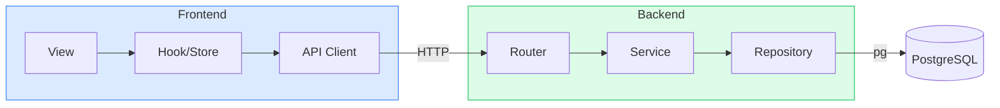

# 프로젝트 구조 설계 원칙 — TodoListApp

---

## 1. 문서 정보

| 항목 | 내용 |
|------|------|
| **버전** | 1.1 |
| **작성일** | 2026-05-13 |
| **작성자** | Architect (kjb980@kjbank.com) |
| **상태** | 초안 (Draft) |
| **기반 문서** | 도메인 정의서 v0.1 (`1-domain-definition.md`), PRD v1.0 (`2-prd.md`), 사용자 시나리오 v1.0 (`3-user-scenario.md`), UC 다이어그램 v1.0 (`99-uc.md`) |

### 변경 이력

| 버전 | 날짜 | 작성자 | 변경 내용 |
|------|------|--------|---------|
| 1.0 | 2026-05-13 | Architect | 초안 작성 — 도메인/PRD/시나리오 v1.0 기반 |

---

## 2. 개요 / 목적

### 2.1 목적

본 문서는 TodoListApp의 **프로젝트 구조 설계 원칙**을 정의한다. 구체적인 코드 스타일 가이드(예: 들여쓰기, 임포트 순서 등)보다 **상위 레벨**의 디렉토리/모듈/의존성/보안 원칙을 다룬다.

### 2.2 적용 범위

- 프론트엔드 (React 19 + TypeScript) 코드베이스 전체
- 백엔드 (Node.js + Express + pg) 코드베이스 전체
- 데이터베이스 마이그레이션 / 시드 / SQL 정책
- Git 협업·환경 설정·시크릿 관리

### 2.3 문서 우선순위

본 문서는 향후 작성될 **코딩 가이드(코드 스타일 가이드, 린트 규칙 등)보다 상위**에 위치한다. 하위 문서가 본 문서와 충돌할 경우 본 문서가 우선한다.

| 우선순위 | 문서 |
|---------|------|
| 1 (최상위) | 도메인 정의서, PRD |
| 2 | **본 문서 (프로젝트 구조 설계 원칙)** |
| 3 | 코딩 스타일 가이드 / 린트 규칙 / 코드 리뷰 체크리스트 |

### 2.4 MVP 일정 현실성

PRD 11장(3일 MVP 일정)을 감안하여, 각 원칙은 **이상적 적용 수준**과 **MVP 단계 최소 적용 수준**을 구분 가능하면 함께 제시한다. 원칙을 핑계로 MVP를 지연시키지 않으며, 동시에 보안·데이터 격리·SQL Injection 방지 등 **타협 불가 항목은 끝까지 지킨다.**

---

## 3. 최상위 원칙 (모든 스택 공통)

| 원칙 | 정의 | Why (왜 필요한가) | TodoListApp 적용 예시 |
|------|------|------------------|---------------------|
| **단일 책임 (SRP)** | 하나의 모듈/함수/파일은 하나의 책임만 갖는다 | 변경 이유가 하나여야 영향 범위 예측 가능 | `auth.service.ts`는 JWT 발급/검증만, `password.util.ts`는 bcrypt만 다룬다 |
| **관심사 분리 (SoC)** | 표현·비즈니스·인프라를 분리한다 | 테스트·재사용·교체 비용 절감 | Router(HTTP)와 Service(비즈니스 규칙)와 Repository(SQL) 분리 |
| **명시성 우선 (Explicit over Implicit)** | 마법(magic)·암묵적 동작을 피한다 | 신규 개발자(+ 미래의 나)의 인지 비용 감소 | 환경변수는 `config/env.ts`로 일괄 검증·노출. `process.env` 직접 참조 금지 |
| **일관성 (Consistency)** | 동일한 문제는 동일한 방식으로 해결한다 | 코드베이스 전체의 예측 가능성 확보 | 모든 DB 조회는 Repository에서, 모든 검증은 `*.validator.ts`에서 |
| **점진적 확장 가능성 (Evolvability)** | 2차 OAuth/다크모드/다국어 등 확장을 염두에 둔다 | PRD 14장의 확장 항목 도입 시 재작성 최소화 | auth 모듈 내부에 strategy 분리 여지를 둔다 (JWT를 default strategy로 취급) |
| **DRY는 신중하게** | 중복은 줄이되 성급한 추상화는 지양 | 잘못된 추상화는 중복보다 더 비싸다 | 두 곳에서만 등장한 코드는 일단 중복 허용. 세 번째 등장 시 추상화 검토 |
| **보안 우선 (Security by Default)** | 보안은 옵션이 아닌 기본값 | 사용자 데이터 격리는 본 제품의 핵심 가치 (PRD 2.3) | 인증 미들웨어를 라우터 단위로 누락 없이 적용. 데이터 쿼리에 `user_id` 조건 누락 금지 |
| **KISS / YAGNI** | 가장 단순한 방식을 우선. 지금 필요 없는 기능은 만들지 않는다 | 3일 MVP 일정에서 과잉 설계는 곧 실패 | Refresh Token, RBAC, 멀티 테넌시 등 MVP 외 기능은 코드에 포함하지 않는다 |

### MVP 최소 적용 수준

위 8개 중 **보안 우선·일관성·관심사 분리**는 Day 1부터 무조건 준수. 나머지는 PR 단위로 점진적 적용.

---

## 4. 의존성 / 레이어 원칙

### 4.1 단방향 의존성 (Outer → Inner)

레이어는 바깥(요청 진입점)에서 안쪽(도메인/인프라)으로만 의존한다. 역방향 의존은 금지한다.

#### 프론트엔드 레이어

```
View (Component / Page)
    ↓
Hook / Store (Zustand, TanStack Query)
    ↓
API Client (axios wrapper, lib/api.ts)
    ↓
[Network] → Backend
```

| 규칙 | 설명 |
|------|------|
| View → Hook | 컴포넌트는 useQuery/useMutation/useStore만 호출. fetch/axios 직접 호출 금지 |
| Hook → API Client | hook 안에서 `apiClient.get('/todos')` 사용. URL 문자열은 `features/*/api/*.ts`에서 관리 |
| 역방향 금지 | API Client가 React Component를 import해서는 안 된다 |

#### 백엔드 레이어 (Router-Service-Repository, PRD 7.5)

```
Router (Express handler)
    ↓
Service (비즈니스 규칙, 트랜잭션 경계)
    ↓
Repository (pg query)
    ↓
PostgreSQL
```

| 규칙 | Why |
|------|-----|
| Router에서 `pg` 직접 호출 금지 | 비즈니스 로직과 SQL이 라우터로 새는 것을 막는다 |
| Service에서 `req` / `res` 객체 접근 금지 | Service는 HTTP를 모른다 → 테스트·재사용 용이 |
| Repository에서 도메인 검증 금지 | Repository는 단순 입출력. 검증은 Service에서 |
| 순환 의존성 금지 | A → B → A 형태 발견 시 즉시 리팩토링 (또는 공통 의존을 별도 모듈로 추출) |

### 4.2 도메인 모델은 인프라를 모른다

`Todo`, `User`, `Category` 같은 도메인 타입은 `pg.QueryResult`, `Request`, `Response` 등 인프라 타입을 import 하지 않는다. 도메인 타입은 `*.types.ts`에 순수 TypeScript 인터페이스로만 정의한다.

### 4.3 의존성 흐름 시각화



---

## 5. 코드 / 네이밍 원칙

### 5.1 케이스 규칙

| 대상 | 케이스 | 예시 |
|------|--------|------|
| 파일·디렉토리 | kebab-case | `todo-service.ts`, `auth-middleware.ts`, `due-date-picker.tsx` |
| 변수·함수 | camelCase | `createTodo`, `isCompleted`, `findByUserId` |
| 클래스·타입·인터페이스 | PascalCase | `Todo`, `User`, `CreateTodoInput`, `TodoRepository` |
| React 컴포넌트 (파일명) | PascalCase 허용 (관례) | `TodoCard.tsx`, `FilterBar.tsx` — 단 프로젝트 전체에서 통일 |
| 상수 | UPPER_SNAKE_CASE | `JWT_ACCESS_TOKEN_TTL_SECONDS`, `BCRYPT_COST` |
| DB 테이블·컬럼 | snake_case | `users`, `password_hash`, `is_completed`, `due_date` |

> **결정사항:** 컴포넌트 파일은 PascalCase(`TodoCard.tsx`), 그 외 모든 파일은 kebab-case. 혼선을 줄이려면 컴포넌트도 kebab-case(`todo-card.tsx`)로 통일하는 것을 권장하나, 본 프로젝트는 React 커뮤니티 관행을 따라 컴포넌트는 PascalCase로 한다.

### 5.2 도메인 용어 일관성

도메인 정의서에 등재된 용어 외 동의어는 사용하지 않는다.

| 표준 용어 | 금지 동의어 |
|----------|----------|
| User | Member, Account, Person |
| Todo | Task, Item, Job |
| Category | Tag, Label, Group |
| due_date | deadline, endDate (단, JSON 응답에서 camelCase 변환 시 `dueDate`는 허용) |
| is_completed | done, finished, isDone |

### 5.3 함수 / 변수 네이밍

| 규칙 | 예시 |
|------|------|
| Boolean은 `is*`, `has*`, `can*` | `isCompleted`, `hasDueDate`, `canEditTodo` |
| 함수명은 동사로 시작 | `createTodo`, `findTodoById`, `markAsCompleted`, `validateEmail` |
| 비동기 함수는 보통 동사로 충분 (`fetch*` 형태도 OK) | `fetchTodos`, `loadCategories` |
| 약어는 다음만 허용 | `id`, `url`, `api`, `db`, `jwt` (대문자 약어 표기는 `userId`, `apiUrl`, `dbPool`, `jwtPayload`처럼 camelCase 결합) |

### 5.4 SQL ↔ JS 컬럼명 변환

PostgreSQL은 snake_case, JS/TS는 camelCase. Repository 레이어에서 명시적으로 매핑한다.

```ts
// Repository 내부 매핑 예시
const row = result.rows[0];
const todo: Todo = {
  id: row.id,
  userId: row.user_id,
  categoryId: row.category_id,
  title: row.title,
  description: row.description,
  dueDate: row.due_date,
  isCompleted: row.is_completed,
  completedAt: row.completed_at,
  createdAt: row.created_at,
  updatedAt: row.updated_at,
};
```

> **MVP 최소 적용:** 매핑 헬퍼 함수 `mapRowToTodo`를 모듈별로 두는 정도면 충분. 범용 case-converter 라이브러리 도입은 YAGNI.

---

## 6. 테스트 / 품질 원칙

### 6.1 테스트 피라미드

```
        E2E (소수)
      ────────────
     Integration (중간)
    ──────────────────
   Unit Tests (다수, 빠름)
```

| 레이어 | 대상 | 도구 (권장) |
|--------|------|----------|
| Unit | Service 함수, 순수 유틸 | Vitest / Jest |
| Integration | Router → Service → Repository → 실제 DB | Vitest + supertest + 실제 PostgreSQL |
| E2E | 핵심 사용자 흐름 (SCN-01, SCN-02, SCN-04) | Playwright (선택) |

### 6.2 백엔드 테스트 정책

- **Service 레이어 단위 테스트 우선.** 비즈니스 규칙(BR-C1, BR-T3 등)이 모두 Service에 모이므로 가장 가성비가 높다.
- **통합 테스트는 실제 PostgreSQL을 사용한다 (mock DB 금지).** pg Raw SQL의 정확성을 ORM 없이 보장할 유일한 방법.
- 통합 테스트용 DB는 **별도 스키마**(예: `todoapp_test`) 사용. 각 테스트 후 `TRUNCATE`로 격리.

### 6.3 프론트엔드 테스트 정책

- 컴포넌트 단위 테스트는 입력/이벤트/렌더 결과 검증 위주 (React Testing Library)
- 핵심 사용자 흐름(SCN-01 회원가입~로그인, SCN-02 첫 할일 등록)은 E2E 1~2개 확보

### 6.4 타입 안정성 / 정적 분석

| 항목 | 규칙 |
|------|------|
| TypeScript | `strict: true` (noImplicitAny, strictNullChecks 포함). `any` 금지 (불가피하면 `unknown` + narrowing) |
| ESLint | `@typescript-eslint/recommended` 기준 + 프로젝트 룰. import 순서 규칙 적용 |
| Prettier | 코드 포매팅 통일. ESLint와 충돌 없도록 `eslint-config-prettier` 적용 |

### 6.5 PR 머지 조건 (이상)

1. 빌드 성공 (frontend, backend 각각)
2. 린트 통과 (ESLint, Prettier)
3. 테스트 통과 (해당 모듈의 단위 + 영향 받는 통합)
4. 1인 개발이라도 셀프 코드 리뷰 (diff를 다시 한 번 본다)

### 6.6 MVP 단계 최소 적용 수준

3일 일정 현실상 모든 Must 기능에 대해 풀 테스트는 불가능. 다음 최소선을 지킨다.

| 항목 | MVP 최소 적용 |
|------|------------|
| 단위 테스트 | 인증(JWT 발급/검증), bcrypt 해시, 카테고리 BR-C1 검증, 필터 SQL 빌더 — 4개 그룹 |
| 통합 테스트 | `POST /api/auth/register` → `POST /api/auth/login` → `POST /api/todos` → `GET /api/todos` 해피패스 1개 |
| E2E | 수동 검증으로 대체 (Day 3 QA 시간) |
| 린트·타입 | strict + ESLint는 Day 1부터 무조건 켠다 |

---

## 7. 설정 / 보안 / 운영 원칙

### 7.1 환경 변수 (.env)

| 규칙 | 비고 |
|------|------|
| `.env`는 **절대 커밋 금지** | `.gitignore`에 반드시 포함 |
| `.env.example` 커밋 (값은 placeholder) | 신규 환경 세팅 가이드 |
| 환경변수는 `config/env.ts` 한 곳에서 로드·검증 후 type-safe 객체로 노출 | `process.env` 직접 참조 금지 |
| 환경별 분리 | `.env.development`, `.env.production` (선택) |

#### 필수 환경 변수 목록

| 키 | 설명 |
|----|------|
| `DATABASE_URL` 또는 `PGHOST/PGPORT/PGUSER/PGPASSWORD/PGDATABASE` | pg 연결 정보 |
| `JWT_SECRET` | JWT 서명 키 (충분히 긴 랜덤 문자열) |
| `JWT_ACCESS_TOKEN_TTL` | 토큰 유효기간 (예: `1h`) |
| `BCRYPT_COST` | bcrypt cost factor (≥ 12) |
| `PORT` | Express 포트 |
| `CORS_ORIGIN` | 허용 Origin |
| `NODE_ENV` | `development` / `production` / `test` |

### 7.2 보안 원칙

| 항목 | 규칙 | 관련 문서 |
|------|------|---------|
| **사용자 데이터 격리** | 모든 todos/categories 쿼리에 `WHERE user_id = $1` 필수. Service 레이어에서 누락 검증 | BR-U3, PRD 7.2 |
| **SQL Injection 방지** | pg Parameterized Query (`$1, $2, ...`)만 사용. 문자열 결합 SQL **금지** | PRD 8.1 |
| **비밀번호** | bcrypt cost factor ≥ 12. 평문 저장·로깅·응답 포함 금지 | BR-U2 |
| **JWT 시크릿** | 환경변수만. 코드 하드코딩 절대 금지 | R-04 (PRD) |
| **입력 검증** | 모든 API 입력은 서버 사이드 검증 (클라이언트 검증은 보조) | PRD 7.2 |
| **HTTPS 강제** | 운영 환경에서 HTTPS만 허용. HTTP 요청은 리다이렉트 또는 거부 | PRD 7.2 |
| **CORS** | `CORS_ORIGIN` 환경변수로 허용 도메인 명시. wildcard `*` 금지 | — |
| **로깅** | 요청 메서드/경로/상태코드/응답시간/에러 스택 로깅. 비밀번호·JWT·이메일 본문은 절대 로그에 남기지 않는다 | PRD 7.5 |
| **에러 응답** | 사용자에게 친화적 메시지만 노출. 스택트레이스·DB 에러 코드 노출 금지 | SCN-11, SCN-15 |
| **JWT 토큰 저장 (클라이언트)** | 클라이언트 측 JWT Access Token은 **Zustand 인메모리 스토어**(`useAuthStore`)에만 저장. localStorage / sessionStorage / Cookie(HTTP Only 포함) 저장 금지. XSS 노출 범위를 메모리로 한정(페이지 닫으면 즉시 소멸). 새로고침 시 메모리 휘발 → 재로그인 필요(MVP 단순화 정책). axios 인터셉터(`lib/api-client.ts`)가 스토어에서 토큰을 읽어 `Authorization: Bearer <token>` 헤더로 부착 | PRD 7.2, SCN-13 |

### 7.3 사용자 데이터 격리 — 구현 규약

```ts
// ❌ 금지 — user_id 조건 없음
const todo = await pool.query('SELECT * FROM todos WHERE id = $1', [id]);

// ✅ 올바름 — user_id 조건 필수
const todo = await pool.query(
  'SELECT * FROM todos WHERE id = $1 AND user_id = $2',
  [id, userId]
);
```

Service 메서드 시그니처에서 **`userId`를 첫 번째 또는 명시적 인자로 받는 것을 강제**한다. 옵션 객체 안에 숨기지 않는다.

---

## 8. 프론트엔드 디렉토리 구조

### 8.1 Feature 기반 폴더 구조 (PRD 7.5)

```
frontend/
├── public/
├── src/
│   ├── features/                   # 도메인(feature) 단위 모듈화
│   │   ├── auth/
│   │   │   ├── components/         # LoginForm.tsx, RegisterForm.tsx
│   │   │   ├── hooks/              # use-login.ts, use-register.ts
│   │   │   ├── api/                # auth-api.ts (axios 호출 정의)
│   │   │   ├── store/              # auth-store.ts — Zustand로 JWT Access Token을 메모리 보관 (`useAuthStore`). localStorage/Cookie 금지
│   │   │   └── types/              # auth.types.ts
│   │   ├── todos/
│   │   │   ├── components/         # TodoCard.tsx, TodoModal.tsx, FilterBar.tsx
│   │   │   ├── hooks/              # use-todos.ts, use-create-todo.ts
│   │   │   ├── api/                # todos-api.ts
│   │   │   └── types/              # todo.types.ts
│   │   ├── categories/
│   │   │   ├── components/
│   │   │   ├── hooks/
│   │   │   ├── api/
│   │   │   └── types/
│   │   └── users/                  # 마이페이지·개인정보 수정·탈퇴
│   │       ├── components/
│   │       ├── hooks/
│   │       ├── api/
│   │       └── types/
│   ├── shared/                     # 여러 feature 공통 자산
│   │   ├── components/             # Button, Input, Modal, ConfirmDialog 등
│   │   ├── hooks/                  # use-debounce 등 범용 hook
│   │   ├── utils/                  # date utils, format utils
│   │   └── types/                  # ApiError 등 공통 타입
│   ├── lib/                        # 외부 라이브러리 wrapper 단일 인스턴스
│   │   ├── api-client.ts           # axios 인스턴스. 인터셉터: `useAuthStore`(Zustand 인메모리)에서 토큰을 읽어 `Authorization: Bearer` 헤더 부착, 401 응답 시 스토어 토큰 초기화 후 로그인 리다이렉트
│   │   └── query-client.ts         # TanStack QueryClient 인스턴스
│   ├── pages/                      # 라우팅 진입점 (React Router)
│   │   ├── LoginPage.tsx
│   │   ├── RegisterPage.tsx
│   │   ├── TodoListPage.tsx
│   │   ├── CategoriesPage.tsx
│   │   └── MyPage.tsx
│   ├── routes/                     # 라우터 정의·보호 라우트 wrapper
│   ├── App.tsx
│   └── main.tsx
├── .env.example
├── .gitignore
├── package.json
├── tsconfig.json
└── vite.config.ts
```

### 8.2 디렉토리별 역할

| 디렉토리 | 역할 | 들어가도 되는 것 | 들어가면 안 되는 것 |
|---------|------|-------------|----------------|
| `features/*/components` | 해당 feature 전용 UI | feature 도메인을 표현하는 컴포넌트 | 다른 feature가 의존할 컴포넌트 |
| `features/*/hooks` | TanStack Query 훅, 폼 로직 훅 | API 호출·캐싱·뮤테이션 | UI JSX |
| `features/*/api` | 백엔드 API 호출 함수 | `apiClient.get('/todos', ...)` | React 코드 |
| `features/*/store` | Zustand 등 클라이언트 상태 | 인증 상태 (JWT Access Token 인메모리 보관, `useAuthStore`), UI 상태(모달 open 등) | 서버 데이터 캐시 (그건 TanStack Query 책임), 토큰의 localStorage/Cookie 영속화 |
| `features/*/types` | 도메인 타입 정의 | `Todo`, `Category`, DTO | React 타입 |
| `shared/*` | feature 횡단 공통 | 디자인 시스템 컴포넌트, 범용 hook/util | 특정 feature 로직 |
| `lib/*` | 단일 인스턴스 외부 의존성 | axios 인스턴스, QueryClient | 비즈니스 로직 |
| `pages/*` | 라우팅 진입점 | features 컴포넌트를 조립 | 비즈니스 로직 (얇게 유지) |

### 8.3 Feature 간 의존성 규칙

| 허용 여부 | 패턴 |
|---------|------|
| 허용 | `features/todos` → `shared/*`, `lib/*` |
| 허용 | `features/todos` → `features/categories/types` (타입만 import) |
| **금지** | `features/todos/components` ↔ `features/users/components` 직접 import |
| 권장 | feature 간 공통 컴포넌트는 `shared`로 승격 |
| 권장 | feature 간 데이터 의존은 `pages`에서 조립 |

### 8.4 MVP 단계 최소 적용

3일 일정상 모든 feature를 풀세트(components/hooks/api/store/types)로 채우기는 어렵다. **존재하지 않는 폴더는 만들지 않는다** (예: `todos`에 별도 store가 필요 없으면 폴더 생략).

---

## 9. 백엔드 디렉토리 구조

### 9.1 Router-Service-Repository + 도메인 모듈화 (PRD 7.5)

```
backend/
├── src/
│   ├── modules/                    # 도메인 단위 모듈
│   │   ├── auth/
│   │   │   ├── auth.router.ts      # POST /register, /login, /logout
│   │   │   ├── auth.service.ts     # JWT 발급, 비밀번호 검증
│   │   │   ├── auth.repository.ts  # (필요 시) — auth는 users repo 재사용 가능
│   │   │   ├── auth.validator.ts   # zod 또는 수동 검증 스키마
│   │   │   └── auth.types.ts
│   │   ├── users/
│   │   │   ├── users.router.ts     # /users/me 조회·수정·탈퇴
│   │   │   ├── users.service.ts
│   │   │   ├── users.repository.ts
│   │   │   ├── users.validator.ts
│   │   │   └── users.types.ts
│   │   ├── todos/
│   │   │   ├── todos.router.ts
│   │   │   ├── todos.service.ts
│   │   │   ├── todos.repository.ts
│   │   │   ├── todos.validator.ts
│   │   │   └── todos.types.ts
│   │   └── categories/
│   │       ├── categories.router.ts
│   │       ├── categories.service.ts
│   │       ├── categories.repository.ts
│   │       ├── categories.validator.ts
│   │       └── categories.types.ts
│   ├── middlewares/
│   │   ├── auth.middleware.ts      # JWT 검증, req.user 주입
│   │   ├── error.middleware.ts     # 통합 에러 핸들러
│   │   └── request-logger.middleware.ts
│   ├── db/
│   │   ├── pool.ts                 # pg.Pool 단일 인스턴스
│   │   ├── migrations/             # SQL 마이그레이션
│   │   │   ├── 20260513_0001_init_users.sql
│   │   │   ├── 20260513_0002_init_categories.sql
│   │   │   └── 20260513_0003_init_todos.sql
│   │   └── seeds/
│   │       └── 20260513_default_categories.sql
│   ├── config/
│   │   └── env.ts                  # 환경변수 로드·검증
│   ├── utils/
│   │   ├── password.ts             # bcrypt wrapper
│   │   ├── jwt.ts                  # jsonwebtoken wrapper
│   │   └── async-handler.ts        # express async error wrapper
│   ├── app.ts                      # Express app 조립 (router, middleware)
│   └── server.ts                   # listen() 진입점
├── .env.example
├── .gitignore
├── package.json
└── tsconfig.json
```

### 9.2 파일별 역할 / 규칙

| 파일 | 책임 | 금지사항 |
|------|------|---------|
| `*.router.ts` | HTTP 경로 정의, 미들웨어 체이닝, 입력 받아 service 호출, 결과를 JSON으로 응답 | 비즈니스 로직, pg 호출 |
| `*.service.ts` | 비즈니스 규칙(BR-*), 트랜잭션 경계, 검증 결과에 따른 분기 | req/res 접근, 직접 pg 호출 (repository 경유) |
| `*.repository.ts` | pg.Pool/Client로 Parameterized Query 실행, row → 도메인 객체 매핑 | 비즈니스 검증, HTTP 응답 |
| `*.validator.ts` | 입력 스키마 정의(zod 권장 또는 수동) | DB 조회 |
| `*.types.ts` | DTO, 도메인 모델 타입 | 런타임 코드 |
| `middlewares/auth.middleware.ts` | JWT 검증, `req.user = { id, ... }` 주입, 실패 시 401 | 비즈니스 로직 |
| `middlewares/error.middleware.ts` | 에러 정규화, HTTP 상태 매핑, 친화적 메시지 응답 | 스택트레이스 응답 노출 |
| `db/pool.ts` | `new Pool(...)` 단일 인스턴스 export | 비즈니스 로직 |
| `config/env.ts` | `process.env` 1회 로드·검증·typed export | 다른 모듈에서 `process.env` 직접 사용 금지 |

### 9.3 pg Pool 운영 규칙

| 규칙 | 설명 |
|------|------|
| Pool은 단일 인스턴스 | `db/pool.ts`에서만 생성. 다른 모듈은 import해서 재사용 |
| Repository에서만 Pool import | Service/Router는 import 금지 |
| 트랜잭션 시 `pool.connect()`로 client 획득 | 끝나면 `client.release()` 보장 (try/finally) |
| 종료 시 graceful shutdown | SIGTERM 시 `pool.end()` 호출 |

### 9.4 SQL 위치 정책

| 유형 | 위치 | 판단 기준 |
|------|------|---------|
| 단일/단순 쿼리 | Repository 메서드 내 인라인 문자열 | 10줄 미만, 동적 분기 없음 |
| 복합 동적 쿼리 (예: todos 필터링) | Repository 내 빌더 함수 + 별도 변수로 정리 | WHERE 절이 옵션에 따라 변동 |
| DDL / 마이그레이션 / 시드 | `db/migrations/`, `db/seeds/` 의 `.sql` 파일 | 스키마 변경 |

> **MVP 단계:** 별도 `.sql` 파일 분리는 마이그레이션/시드에만 적용. 쿼리 SQL은 인라인 유지.

---

## 10. 데이터베이스 / SQL 관련 원칙

### 10.1 ORM 금지 — Raw SQL + Parameterized Query

PRD 8.1의 핵심 제약. Prisma/TypeORM/Sequelize 등 모든 ORM·Query Builder 도입 금지. 이유:
- PRD에서 명시적으로 요구한 학습/제약 조건
- SQL 가독성·디버깅 용이성
- pg 라이브러리 직접 사용으로 PostgreSQL 고유 기능(JSONB 등) 활용 자유

### 10.2 Parameterized Query 강제

```ts
// ❌ SQL Injection 위험 — 절대 금지
const result = await pool.query(`SELECT * FROM users WHERE email = '${email}'`);

// ✅ 올바름
const result = await pool.query('SELECT * FROM users WHERE email = $1', [email]);
```

### 10.3 마이그레이션 파일 명명

```
{YYYYMMDD}_{NNNN}_{snake_case_description}.sql
```

| 예시 | 설명 |
|------|------|
| `20260513_0001_init_users.sql` | users 테이블 생성 |
| `20260513_0002_init_categories.sql` | categories 테이블 + FK |
| `20260513_0003_init_todos.sql` | todos 테이블 + FK + 인덱스 |
| `20260513_0004_seed_default_categories.sql` | 기본 카테고리 시드 (혹은 `seeds/`로 분리) |

- 모든 DDL은 마이그레이션 파일에서 관리. 운영 DB에 콘솔로 `CREATE TABLE` 직접 실행 금지.
- MVP 단계에서는 별도 마이그레이션 도구(node-pg-migrate 등) 도입 없이 **단순 `.sql` 파일 + 적용 스크립트**로 충분.

### 10.4 트랜잭션 사용 기준

다중 테이블 변경이 한 비즈니스 작업으로 묶이면 트랜잭션 필수.

| 시나리오 | 트랜잭션 대상 |
|---------|-----------|
| SCN-10 회원 탈퇴 (FR-05) | todos 삭제 → 사용자 정의 categories 삭제 → users 삭제 |
| SCN-08 카테고리 재분류 후 삭제 (OI-01 결정에 따라) | todos.category_id UPDATE → categories DELETE |

```ts
const client = await pool.connect();
try {
  await client.query('BEGIN');
  await client.query('DELETE FROM todos WHERE user_id = $1', [userId]);
  await client.query('DELETE FROM categories WHERE user_id = $1', [userId]);
  await client.query('DELETE FROM users WHERE id = $1', [userId]);
  await client.query('COMMIT');
} catch (e) {
  await client.query('ROLLBACK');
  throw e;
} finally {
  client.release();
}
```

> CASCADE FK를 걸어두면 todos/categories 삭제를 DB에 위임 가능. 단, 어느 쪽이든 **트랜잭션으로 감싸는 원칙 자체는 유지**.

### 10.5 인덱스 / 제약

PRD 10.2의 인덱스 전략을 마이그레이션 파일에 그대로 반영. `users.email` UNIQUE, `todos(user_id)`, `todos(user_id, is_completed)`, `todos(user_id, due_date)`, `categories(user_id)` 인덱스를 Day 1 DDL에 포함.

---

## 11. Git / 협업 원칙

### 11.1 브랜치 전략 (1인 개발)

| 브랜치 | 용도 |
|--------|------|
| `main` | 항상 배포 가능 상태 |
| `feature/<short-name>` | 기능 개발 (예: `feature/todo-crud`, `feature/auth`) |
| `fix/<short-name>` | 버그 수정 |
| `chore/<short-name>` | 환경/설정/문서 변경 |

1인 개발이므로 `develop` 브랜치는 두지 않는다. feature 브랜치에서 작업 → main으로 PR(또는 직접 머지). MVP 일정상 빠른 개발이 우선.

### 11.2 커밋 메시지 (Conventional Commits)

```
<type>(<scope>): <subject>

[optional body]
[optional footer]
```

| type | 용도 |
|------|------|
| `feat` | 새 기능 |
| `fix` | 버그 수정 |
| `refactor` | 동작 변경 없는 구조 개선 |
| `test` | 테스트 추가/수정 |
| `docs` | 문서 |
| `chore` | 빌드/도구/의존성 |
| `style` | 포매팅 |

예시:
```
feat(todos): 할일 복합 필터링 API 구현 (FR-09)
fix(auth): JWT 만료 시 401 응답 누락 수정
docs: 프로젝트 구조 설계 원칙 v1.0 추가
```

### 11.3 .gitignore 필수 항목

```
# 의존성
node_modules/

# 환경변수
.env
.env.*.local
!.env.example

# 빌드 산출물
dist/
build/
.next/
.cache/

# 로그
*.log
npm-debug.log*

# 에디터
.vscode/
.idea/
.DS_Store

# 테스트 / 커버리지
coverage/
.nyc_output/
```

---

## 12. 확장 시 고려사항 (PRD 14장 반영)

| 확장 항목 | 사전 설계 포인트 | 적용 시점 |
|---------|--------------|---------|
| **OAuth Social Login** | auth 모듈을 strategy 패턴으로 분리 (`auth.strategy.local.ts`, `auth.strategy.google.ts`). 1차에서는 local만 구현하되 인터페이스는 분리 | 2차 |
| **Refresh Token** | JWT 발급 함수에서 `access` / `refresh` 두 토큰 발급 가능한 구조로 시그니처 미리 잡아둔다 | 2차 |
| **다크모드** | 1차부터 색상은 CSS 변수로 정의 (`--color-bg`, `--color-text`). 2차에서 테마 토글만 추가 | 2차 |
| **다국어 (i18n)** | 화면 텍스트는 직접 문자열 대신 `t('todo.title')` 형태 추상화 유지. 1차에서는 임시 한국어 사전 객체로도 충분 | 2차 |
| **알림 / 리마인더** | `modules/notifications/` 신설. 도메인 이벤트(`TodoCreated`, `TodoDueSoon`)를 service에서 발행하는 구조 검토 | 3차 |
| **할일 공유 / 협업** | `todos.user_id` 단일 컬럼 → `todo_members` 조인 테이블로 확장. user_id 격리 쿼리를 자연스럽게 멤버십 쿼리로 교체 | 미정 |
| **모바일 네이티브 앱** | 현 REST API를 그대로 재사용. CORS 정책에 모바일 origin 추가 | 미정 |
| **관리자 콘솔** | RBAC 도입. `users.role` 컬럼 추가, auth.middleware에 역할 확인 옵션 추가 | 미정 |

### 확장 비용 최소화를 위한 1차 결정

- 컴포넌트의 색상은 **반드시 CSS 변수** 사용 (하드코딩된 hex 금지)
- 화면 텍스트는 **번역 가능성을 가정**하고 컴포넌트 외부 또는 상수 객체로 분리
- 인증은 **JWT를 default strategy**로 취급하되, `req.user` 인터페이스는 strategy 무관하게 일정 형태 유지

---

## 13. 변경 이력

| 버전 | 날짜 | 작성자 | 변경 내용 |
|------|------|--------|---------|
| 1.0 | 2026-05-13 | Architect | 초안 작성 — 도메인/PRD/시나리오/UC v1.0 기반 |
| 1.1 | 2026-05-13 | Architect | JWT 토큰 저장 정책 명시 — 7장 보안 원칙에 Zustand 인메모리(`useAuthStore`) 저장 규칙 추가, 8장 디렉토리 설명에 store/lib/api-client 주석 보완 (localStorage/Cookie 금지) |

---

*본 문서는 도메인 정의서 v0.1, PRD v1.0을 기반으로 작성되었으며, 상위 문서 변경 시 본 문서도 함께 업데이트되어야 한다. 본 문서는 향후 작성될 코딩 가이드보다 상위에 위치하며, 충돌 시 본 문서가 우선한다.*
