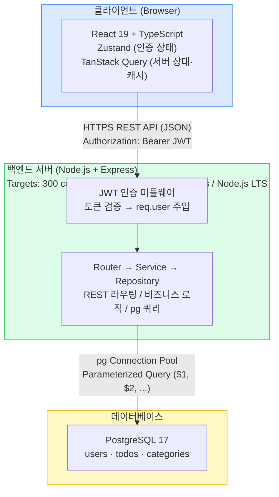
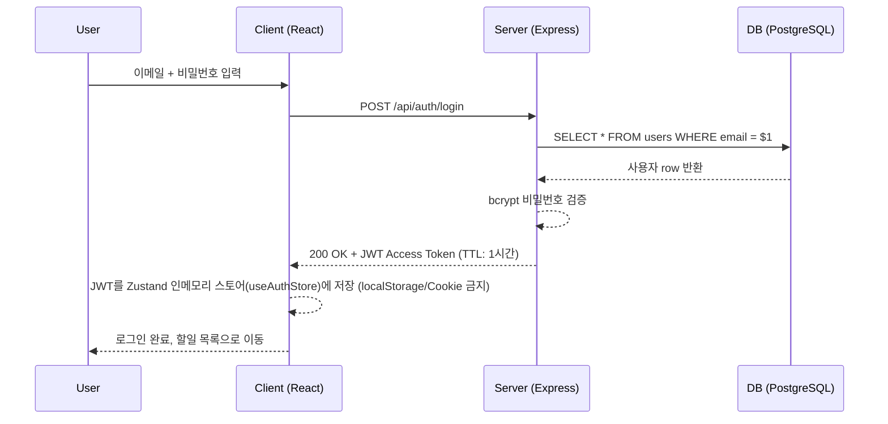
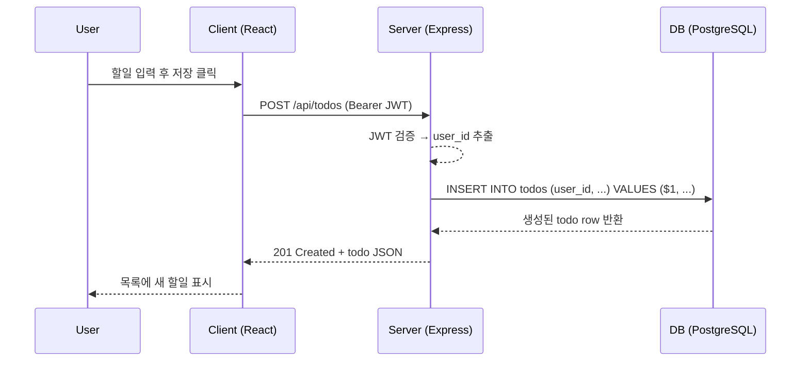

# 기술 아키텍처 다이어그램 — TodoListApp

---

## 1. 문서 정보

| 항목 | 내용 |
|------|------|
| **버전** | 1.2 |
| **작성일** | 2026-05-13 |
| **상태** | 초안 (Draft) |
| **기반 문서** | PRD v1.1 (`2-prd.md`), 프로젝트 구조 설계 원칙 v1.0 (`4-project-structure-principles.md`) |

---

## 2. 개요

TodoListApp은 브라우저에서 동작하는 React 클라이언트, Node.js/Express 기반의 REST API 서버, PostgreSQL 17 데이터베이스로 구성된 3계층 구조다. 클라이언트는 JWT를 HTTP Authorization 헤더에 담아 서버와 통신하며, 서버는 인증 미들웨어에서 토큰을 검증한 뒤 Router → Service → Repository 순서로 요청을 처리한다. 모든 DB 접근은 ORM 없이 pg 라이브러리의 Parameterized Query로만 수행하여 SQL Injection을 원천 차단한다.

---

## 3. 전체 아키텍처 다이어그램

---

## 4. 요청 흐름

### 4-1. 로그인 흐름

### 4-2. 할일 등록 흐름

---

## 5. 컴포넌트 책임 요약

| 컴포넌트 | 역할 | 기술 |
|---|---|---|
| React App | UI 렌더링 및 사용자 상호작용 | React 19 + TypeScript |
| Zustand (`useAuthStore`) | 클라이언트 전역 상태 — **JWT Access Token 인메모리 저장** 및 인증 플래그 관리. localStorage/sessionStorage/Cookie(HTTP Only 포함) 사용 금지. 새로고침 시 휘발 → 재로그인 필요. axios 인터셉터가 본 스토어에서 토큰을 읽어 `Authorization: Bearer` 헤더 부착 | Zustand |
| TanStack Query | 서버 상태 캐싱 및 동기화 | TanStack Query |
| Express Router | HTTP 엔드포인트 라우팅 | Express |
| JWT Middleware | Bearer 토큰 검증, req.user 주입 | jsonwebtoken |
| Service Layer | 비즈니스 규칙 (BR-*) 처리 | JavaScript (Node.js) |
| Repository | Parameterized Query 실행, row 매핑 | pg (ORM 금지) |
| Connection Pool | DB 연결 재사용 (max 20) | pg.Pool |
| bcrypt | 비밀번호 단방향 해시 (cost ≥ 12) | bcrypt |
| PostgreSQL | 데이터 영속화 (users, todos, categories) | PostgreSQL 17 |

---

## 6. 변경 이력

| 버전 | 날짜 | 작성자 | 변경 내용 |
|------|------|--------|---------|
| 1.0 | 2026-05-13 | Architect | 초안 작성 — PRD v1.0, 프로젝트 구조 설계 원칙 v1.0 기반 |
| 1.1 | 2026-05-13 | Architect | 컴포넌트 책임표에 bcrypt·Connection Pool 추가, NFR 타겟 주석, JWT TTL 명시 |
| 1.2 | 2026-05-13 | Architect | JWT 토큰 Zustand 메모리 저장 정책 명시 — §4-1 로그인 시퀀스에 메모리 저장 단계 추가, §5 컴포넌트 책임표 Zustand 행에 `useAuthStore` 인메모리 저장 역할 반영 (localStorage/Cookie 금지) |
