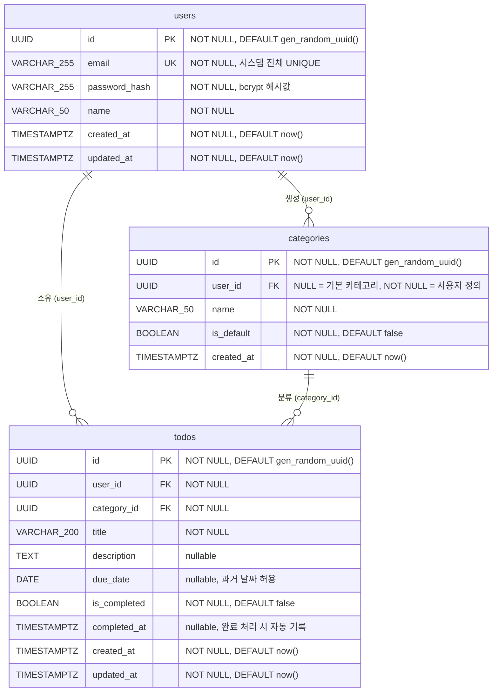

# ERD (Entity-Relationship Diagram) — TodoListApp

> **버전:** 1.0
> **작성일:** 2026-05-13
> **기반 문서:**
> - PRD v1.2 (`2-prd.md`) — 10장 데이터 모델 (ERD, 인덱스, ON DELETE 정책, 데이터 규칙) 전체
> - 도메인 정의서 v0.2 (`1-domain-definition.md`) — 비즈니스 규칙 (BR-U4 포함)
> **상태:** 초안 (Draft)

---

## 목차

1. [개요](#1-개요)
2. [엔티티 요약 표](#2-엔티티-요약-표)
3. [ERD 다이어그램](#3-erd-다이어그램)
4. [테이블별 상세 명세](#4-테이블별-상세-명세)
   - 4.1 [users](#41-users)
   - 4.2 [categories](#42-categories)
   - 4.3 [todos](#43-todos)
5. [외래키 ON DELETE 정책](#5-외래키-on-delete-정책)
6. [인덱스 전략](#6-인덱스-전략)
7. [시드 데이터 (기본 카테고리)](#7-시드-데이터-기본-카테고리)
8. [주요 데이터 규칙 (BR 매핑)](#8-주요-데이터-규칙-br-매핑)
9. [DDL 예시 (참고용)](#9-ddl-예시-참고용)
10. [변경 이력](#10-변경-이력)

---

## 1. 개요

### 목적

본 문서는 TodoListApp의 데이터베이스 스키마를 Mermaid ERD 형식으로 명세하고, 테이블별 컬럼 정의·인덱스 전략·외래키 정책·비즈니스 규칙 매핑을 제공한다. 개발자가 마이그레이션 스크립트 작성 및 Repository 레이어 구현 시 단일 참조 문서로 활용하는 것을 목적으로 한다.

### 적용 범위

- 데이터베이스: PostgreSQL 17
- 대상 테이블: `users`, `categories`, `todos` (MVP In Scope 전체)
- ORM 금지 정책에 따라 Raw SQL + Parameterized Query 기반으로 설계된다 (PRD 7.2, 8.1)

### PRD 10장과의 관계

본 문서는 PRD v1.2 10장(데이터 모델)의 **상세화 문서**이다. PRD 10.1의 ERD를 기반으로 다음 내용을 보강한다.

- PostgreSQL 17 전용 구체 타입 지정 (`UUID`, `VARCHAR(N)`, `TIMESTAMPTZ` 등)
- PK / FK / UK / NOT NULL / nullable / DEFAULT 값 명시
- 테이블별 컬럼 명세표 및 인덱스 생성 근거
- 실제 마이그레이션에 사용 가능한 수준의 DDL 예시

PRD와 본 문서가 상충할 경우 PRD를 우선한다.

---

## 2. 엔티티 요약 표

| 엔티티 | 테이블명 | 설명 | 핵심 비즈니스 규칙 |
|--------|----------|------|-------------------|
| 사용자 | `users` | 인증된 사용자 계정. JWT 인증의 주체이며 모든 데이터의 소유자. | BR-U1, BR-U2, BR-U3, BR-U4 |
| 카테고리 | `categories` | 할일 분류 카테고리. 시스템 제공 기본 카테고리와 사용자 정의 카테고리로 구분. | BR-C1, BR-C2, BR-C3, BR-C4 |
| 할일 | `todos` | 할일 항목. 반드시 사용자와 카테고리에 귀속되어야 하며, 완료 상태를 관리. | BR-T1, BR-T2, BR-T3, BR-T4, BR-T5 |

---

## 3. ERD 다이어그램



### 관계 설명

| 관계 | 카디널리티 | 설명 |
|------|-----------|------|
| `users` → `todos` | 1 : N | 한 사용자는 0개 이상의 할일을 소유한다. 할일은 반드시 한 사용자에 귀속된다. |
| `users` → `categories` | 1 : N | 한 사용자는 0개 이상의 사용자 정의 카테고리를 생성한다. 기본 카테고리는 `user_id = NULL`로 어느 사용자에도 귀속되지 않는다. |
| `categories` → `todos` | 1 : N | 하나의 카테고리는 0개 이상의 할일을 분류한다. 할일은 반드시 하나의 카테고리에 속한다. |

---

## 4. 테이블별 상세 명세

### 4.1 users

#### 컬럼 명세

| 컬럼명 | 타입 | 제약 | 기본값 | 설명 |
|--------|------|------|--------|------|
| `id` | `UUID` | PK, NOT NULL | `gen_random_uuid()` | 사용자 고유 식별자 |
| `email` | `VARCHAR(255)` | UNIQUE, NOT NULL | — | 로그인 ID. 시스템 전체 고유. |
| `password_hash` | `VARCHAR(255)` | NOT NULL | — | bcrypt 해시값만 저장. 평문 저장 금지. |
| `name` | `VARCHAR(50)` | NOT NULL | — | 표시 이름 |
| `created_at` | `TIMESTAMPTZ` | NOT NULL | `now()` | 계정 생성일시 (타임존 포함) |
| `updated_at` | `TIMESTAMPTZ` | NOT NULL | `now()` | 마지막 수정일시 (타임존 포함). 개인정보 수정 시 갱신. |

#### 인덱스

| 인덱스명 | 컬럼 | 종류 | 근거 |
|----------|------|------|------|
| `users_pkey` | `id` | PRIMARY KEY (자동 생성) | PK 기본 인덱스 |
| `users_email_key` | `email` | UNIQUE (자동 생성) | UNIQUE 제약으로 자동 생성. 로그인 시 이메일 조회 성능 확보. |

#### 외래키 제약

없음 (최상위 엔티티)

#### 적용 비즈니스 규칙

| 규칙 ID | 내용 | 구현 위치 |
|---------|------|----------|
| BR-U1 | `email` UNIQUE 제약 — 중복 가입 불가 | DB UNIQUE 제약 |
| BR-U2 | `password_hash`에 bcrypt 해시값만 저장 (cost factor ≥ 12) | 서비스 레이어 |
| BR-U3 | 모든 Todo/Category 쿼리에 `WHERE user_id = $1` 조건 필수 | Repository 레이어 |
| BR-U4 | 회원 탈퇴 시 사용자 본인의 모든 데이터 즉시 하드 삭제 (복구 불가) | ON DELETE CASCADE + 서비스 레이어 트랜잭션 |

---

### 4.2 categories

#### 컬럼 명세

| 컬럼명 | 타입 | 제약 | 기본값 | 설명 |
|--------|------|------|--------|------|
| `id` | `UUID` | PK, NOT NULL | `gen_random_uuid()` | 카테고리 고유 식별자 |
| `user_id` | `UUID` | FK (users.id), nullable | `NULL` | NULL이면 기본 카테고리. NOT NULL이면 사용자 정의 카테고리. |
| `name` | `VARCHAR(50)` | NOT NULL | — | 카테고리명 |
| `is_default` | `BOOLEAN` | NOT NULL | `false` | 기본 카테고리 여부. 기본 카테고리는 수정/삭제 금지. |
| `created_at` | `TIMESTAMPTZ` | NOT NULL | `now()` | 카테고리 생성일시 (타임존 포함) |

#### 인덱스

| 인덱스명 | 컬럼 | 종류 | 근거 |
|----------|------|------|------|
| `categories_pkey` | `id` | PRIMARY KEY (자동 생성) | PK 기본 인덱스 |
| `idx_categories_user_id` | `user_id` | B-Tree | 사용자 카테고리 목록 조회 시 `WHERE user_id = $1` 성능 확보 |

#### 외래키 제약

| FK 컬럼 | 참조 테이블/컬럼 | ON DELETE | 설명 |
|---------|----------------|-----------|------|
| `user_id` | `users(id)` | `CASCADE` | 회원 탈퇴 시 해당 사용자의 카테고리 자동 삭제. `user_id IS NULL`인 기본 카테고리는 영향 없음. |

#### 적용 비즈니스 규칙

| 규칙 ID | 내용 | 구현 위치 |
|---------|------|----------|
| BR-C1 | `is_default = true`인 카테고리는 UPDATE/DELETE 금지 | 서비스 레이어에서 `is_default` 검증 |
| BR-C2 | 기본 카테고리는 `user_id IS NULL`로 모든 사용자에게 공통 제공 | 시드 데이터 + DB 설계 |
| BR-C3 | 사용자 정의 카테고리는 해당 사용자만 조회·수정·삭제 가능 | Repository 레이어 `WHERE user_id = $1` |
| BR-C4 | 카테고리 삭제 전 연결된 Todo 존재 여부 검사 (OI-01 미결 상태) | 서비스 레이어 사전 검사 또는 `RESTRICT` FK |

---

### 4.3 todos

#### 컬럼 명세

| 컬럼명 | 타입 | 제약 | 기본값 | 설명 |
|--------|------|------|--------|------|
| `id` | `UUID` | PK, NOT NULL | `gen_random_uuid()` | 할일 고유 식별자 |
| `user_id` | `UUID` | FK (users.id), NOT NULL | — | 소유 사용자. 반드시 귀속 필요. |
| `category_id` | `UUID` | FK (categories.id), NOT NULL | — | 분류 카테고리. 반드시 하나의 카테고리에 속해야 함. |
| `title` | `VARCHAR(200)` | NOT NULL | — | 할일 제목 |
| `description` | `TEXT` | nullable | `NULL` | 할일 상세 설명 (선택 입력) |
| `due_date` | `DATE` | nullable | `NULL` | 종료예정일. 과거 날짜 허용. CHECK 제약 없음. |
| `is_completed` | `BOOLEAN` | NOT NULL | `false` | 완료 여부 |
| `completed_at` | `TIMESTAMPTZ` | nullable | `NULL` | 완료 처리 일시. 완료 시 자동 기록, 완료 취소 시 NULL 복원. |
| `created_at` | `TIMESTAMPTZ` | NOT NULL | `now()` | 할일 등록일시 (타임존 포함) |
| `updated_at` | `TIMESTAMPTZ` | NOT NULL | `now()` | 마지막 수정일시 (타임존 포함) |

#### 인덱스

| 인덱스명 | 컬럼 | 종류 | 근거 |
|----------|------|------|------|
| `todos_pkey` | `id` | PRIMARY KEY (자동 생성) | PK 기본 인덱스 |
| `idx_todos_user_id` | `user_id` | B-Tree | 사용자별 할일 목록 조회 기본 인덱스 |
| `idx_todos_user_id_is_completed` | `(user_id, is_completed)` | B-Tree (복합) | 완료 여부 필터 (`WHERE user_id = $1 AND is_completed = $2`) 성능 확보 |
| `idx_todos_user_id_due_date` | `(user_id, due_date)` | B-Tree (복합) | 기간 필터 (`WHERE user_id = $1 AND due_date BETWEEN $2 AND $3`) 성능 확보 |
| `idx_todos_category_id` | `category_id` | B-Tree | 카테고리 삭제 전 연결된 할일 존재 여부 확인 쿼리 성능 확보 |

#### 외래키 제약

| FK 컬럼 | 참조 테이블/컬럼 | ON DELETE | 설명 |
|---------|----------------|-----------|------|
| `user_id` | `users(id)` | `CASCADE` | 회원 탈퇴 시 해당 사용자의 모든 할일 자동 삭제 (BR-U4) |
| `category_id` | `categories(id)` | `RESTRICT` | 할일이 존재하는 카테고리 삭제 거부. OI-01 정책에 따라 변경 가능 (`SET DEFAULT` 또는 기본 카테고리 재분류 후 삭제). |

#### 적용 비즈니스 규칙

| 규칙 ID | 내용 | 구현 위치 |
|---------|------|----------|
| BR-T1 | 할일은 반드시 특정 사용자에 귀속 (`user_id` NOT NULL) | DB NOT NULL 제약 |
| BR-T2 | 할일은 반드시 하나의 카테고리에 속해야 함 (`category_id` NOT NULL) | DB NOT NULL 제약 |
| BR-T3 | 완료 처리 시 `completed_at = NOW()` 자동 기록. 완료 취소 시 `completed_at = NULL`. | 서비스 레이어 |
| BR-T4 | 완료된 할일도 제목·설명·카테고리 등 수정 허용 | 서비스 레이어 (완료 여부로 수정 차단 없음) |
| BR-T5 | `due_date`에 과거 날짜 허용 (CHECK 제약 없음) | 설계 의도적 미제약 |

---

## 5. 외래키 ON DELETE 정책

PRD v1.2 10.3을 그대로 반영한다.

| 테이블 | FK 컬럼 | 참조 | ON DELETE | 설명 |
|--------|---------|------|-----------|------|
| `todos` | `user_id` | `users(id)` | `CASCADE` | 회원 탈퇴 시 해당 사용자의 모든 할일 자동 삭제. BR-U4, 데이터 보존 정책(PRD 7.4) 충족. |
| `todos` | `category_id` | `categories(id)` | `RESTRICT` | 할일이 존재하는 카테고리 삭제를 DB 레벨에서 거부. OI-01 결정에 따라 재분류 후 삭제 정책으로 변경 가능. |
| `categories` | `user_id` | `users(id)` | `CASCADE` | 회원 탈퇴 시 사용자 정의 카테고리 자동 삭제. `user_id IS NULL`인 기본 카테고리는 이 FK에 해당하지 않으므로 영향 없음. |

> 회원 탈퇴 시 트랜잭션 내에서 `users` 레코드 삭제 한 번으로 CASCADE가 연쇄 작동하여 `todos`와 `categories`(사용자 정의)가 자동 정리된다. R-05 리스크 대응.

---

## 6. 인덱스 전략

PRD v1.2 10.2를 그대로 반영하며, 각 인덱스의 필요 근거를 추가한다.

| 테이블 | 인덱스명 | 인덱스 컬럼 | 목적 / 근거 |
|--------|----------|-----------|------------|
| `users` | `users_email_key` | `email` | 로그인 시 이메일로 사용자 조회. UNIQUE 제약으로 자동 생성. |
| `todos` | `idx_todos_user_id` | `user_id` | 사용자별 할일 목록 기본 조회 (`GET /api/todos`). 모든 할일 쿼리의 최상위 필터. |
| `todos` | `idx_todos_user_id_is_completed` | `(user_id, is_completed)` | 완료 여부 필터 조합. 미완료 목록 조회 등 가장 빈번한 복합 필터 패턴. |
| `todos` | `idx_todos_user_id_due_date` | `(user_id, due_date)` | 종료예정일 기간 필터 (`due_date_from ~ due_date_to`). 날짜 범위 스캔 최적화. |
| `todos` | `idx_todos_category_id` | `category_id` | 카테고리 삭제 전 연결된 할일 존재 여부 검사 (`SELECT 1 FROM todos WHERE category_id = $1`). |
| `categories` | `idx_categories_user_id` | `user_id` | 사용자 카테고리 목록 조회 (`WHERE user_id = $1 OR user_id IS NULL`). |

> 복합 인덱스 `(user_id, is_completed)`, `(user_id, due_date)`는 선행 컬럼 `user_id` 단독 조회에도 활용된다. `idx_todos_user_id` 단순 인덱스와 중복될 수 있으나, 복합 필터 쿼리의 인덱스 커버리지 향상을 위해 병존한다. 운영 환경의 쿼리 패턴에 따라 `EXPLAIN ANALYZE`로 재검토를 권장한다.

---

## 7. 시드 데이터 (기본 카테고리)

기본 카테고리는 `is_default = true`, `user_id IS NULL`로 시드 데이터를 삽입한다. 모든 사용자에게 공통으로 제공되며, 회원 탈퇴 시에도 삭제되지 않는다 (BR-C2).

> **OI-02 미결 상태:** 기본 카테고리의 정확한 초기값 목록은 구현 시 개발자/제품 오너가 확정해야 한다. 아래는 PRD 12.2 가정사항 및 일반적인 개인 할일 관리 맥락을 고려한 권장 초기값 예시이다.

### 권장 초기 시드 예시

| id | user_id | name | is_default | created_at |
|----|---------|------|------------|------------|
| `gen_random_uuid()` | `NULL` | 업무 | `true` | `now()` |
| `gen_random_uuid()` | `NULL` | 개인 | `true` | `now()` |
| `gen_random_uuid()` | `NULL` | 학습 | `true` | `now()` |
| `gen_random_uuid()` | `NULL` | 기타 | `true` | `now()` |

### 시드 SQL 예시

> 멱등성은 categories 테이블의 부분 UNIQUE 인덱스 `uq_categories_default_name (name) WHERE is_default = true AND user_id IS NULL`로 보장된다 (마이그레이션 `20260513_0002_init_categories.sql`).

```sql
INSERT INTO categories (id, user_id, name, is_default, created_at)
VALUES
    (gen_random_uuid(), NULL, '업무', true, now()),
    (gen_random_uuid(), NULL, '개인', true, now()),
    (gen_random_uuid(), NULL, '학습', true, now()),
    (gen_random_uuid(), NULL, '기타',  true, now())
ON CONFLICT (name) WHERE (is_default = true AND user_id IS NULL) DO NOTHING;
```

---

## 8. 주요 데이터 규칙 (BR 매핑)

PRD v1.2 10.4를 기반으로 하며, 도메인 정의서 v0.2의 BR-U4를 추가 반영한다.

| 규칙 ID | 내용 | 적용 테이블/컬럼 | 구현 위치 |
|---------|------|----------------|----------|
| BR-U1 | `users.email` UNIQUE 제약 — 이메일 중복 가입 불가 | `users.email` | DB UNIQUE 제약 |
| BR-U2 | `password_hash`는 bcrypt 해시값만 저장 (cost factor ≥ 12). 평문 저장 절대 금지. | `users.password_hash` | 서비스 레이어 |
| BR-U3 | 모든 Todo/Category 쿼리에 `WHERE user_id = $1` 조건 필수. 타 사용자 데이터 접근 시 403 반환. | `todos.user_id`, `categories.user_id` | Repository 레이어 |
| BR-U4 | 회원 탈퇴 시 사용자 본인의 모든 데이터(할일, 사용자 정의 카테고리) 즉시 하드 삭제. 소프트 삭제 없음. 복구 불가. 기본 카테고리(`user_id IS NULL`)는 영향 없음. | `users`, `todos`, `categories` | ON DELETE CASCADE + 서비스 레이어 트랜잭션 |
| BR-C1 | `is_default = true`인 Category는 UPDATE/DELETE 금지 | `categories.is_default` | 서비스 레이어에서 `is_default` 사전 검증 |
| BR-C2 | 기본 카테고리는 `user_id IS NULL`로 모든 사용자에게 공통 제공 | `categories.user_id` | 시드 데이터 + DB 설계 |
| BR-C3 | 사용자 정의 카테고리는 해당 사용자만 조회·수정·삭제 가능 | `categories.user_id` | Repository 레이어 |
| BR-C4 | Category 삭제 전 연결된 Todo 존재 여부 검사. 존재 시 삭제 거부 (RESTRICT) 또는 기본 카테고리로 재분류 후 삭제 (OI-01 결정 필요). | `todos.category_id` | 서비스 레이어 + FK RESTRICT |
| BR-T1 | 할일은 반드시 특정 사용자에 귀속 (`user_id` NOT NULL, FK 필수) | `todos.user_id` | DB NOT NULL + FK 제약 |
| BR-T2 | 할일은 반드시 하나의 카테고리에 속해야 함 (`category_id` NOT NULL, FK 필수) | `todos.category_id` | DB NOT NULL + FK 제약 |
| BR-T3 | 완료 처리 시 `completed_at = NOW()` 자동 기록. 완료 취소 시 `is_completed = false`, `completed_at = NULL`. | `todos.is_completed`, `todos.completed_at` | 서비스 레이어 |
| BR-T4 | 완료된 할일도 제목·설명·종료예정일·카테고리 수정 허용 (완료 여부에 의한 수정 차단 없음) | `todos` 전반 | 서비스 레이어 (무제약 허용) |
| BR-T5 | `due_date`에 과거 날짜 허용. DB CHECK 제약 없음. 기간 초과 할일 추적 목적. | `todos.due_date` | 설계 의도적 미제약 |

---

## 9. DDL 예시 (참고용)

PostgreSQL 17 기준. 실제 마이그레이션 스크립트로 그대로 사용 가능한 수준으로 작성한다. pg/Raw SQL 정책에 부합하며, ORM 마이그레이션 도구 없이 직접 실행한다.

```sql
-- ============================================================
-- TodoListApp — 초기 스키마 마이그레이션
-- 대상 DB: PostgreSQL 17
-- 정책: Raw SQL, ORM 사용 금지 (PRD 8.1)
-- ============================================================

-- ────────────────────────────────────────
-- 1. users
-- ────────────────────────────────────────
CREATE TABLE IF NOT EXISTS users (
    id            UUID          NOT NULL DEFAULT gen_random_uuid(),
    email         VARCHAR(255)  NOT NULL,
    password_hash VARCHAR(255)  NOT NULL,
    name          VARCHAR(50)   NOT NULL,
    created_at    TIMESTAMPTZ   NOT NULL DEFAULT now(),
    updated_at    TIMESTAMPTZ   NOT NULL DEFAULT now(),

    CONSTRAINT users_pkey      PRIMARY KEY (id),
    CONSTRAINT users_email_key UNIQUE (email)
);

-- ────────────────────────────────────────
-- 2. categories
-- ────────────────────────────────────────
CREATE TABLE IF NOT EXISTS categories (
    id         UUID         NOT NULL DEFAULT gen_random_uuid(),
    user_id    UUID,                                          -- NULL = 기본 카테고리
    name       VARCHAR(50)  NOT NULL,
    is_default BOOLEAN      NOT NULL DEFAULT false,
    created_at TIMESTAMPTZ  NOT NULL DEFAULT now(),

    CONSTRAINT categories_pkey    PRIMARY KEY (id),
    CONSTRAINT categories_user_fk FOREIGN KEY (user_id)
        REFERENCES users (id)
        ON DELETE CASCADE                                     -- 회원 탈퇴 시 사용자 카테고리 자동 삭제
        DEFERRABLE INITIALLY DEFERRED
);

CREATE INDEX IF NOT EXISTS idx_categories_user_id
    ON categories (user_id);

-- ────────────────────────────────────────
-- 3. todos
-- ────────────────────────────────────────
CREATE TABLE IF NOT EXISTS todos (
    id           UUID         NOT NULL DEFAULT gen_random_uuid(),
    user_id      UUID         NOT NULL,
    category_id  UUID         NOT NULL,
    title        VARCHAR(200) NOT NULL,
    description  TEXT,
    due_date     DATE,                                        -- nullable, 과거 날짜 허용, CHECK 제약 없음
    is_completed BOOLEAN      NOT NULL DEFAULT false,
    completed_at TIMESTAMPTZ,                                 -- 완료 처리 시 서비스 레이어에서 now() 설정
    created_at   TIMESTAMPTZ  NOT NULL DEFAULT now(),
    updated_at   TIMESTAMPTZ  NOT NULL DEFAULT now(),

    CONSTRAINT todos_pkey        PRIMARY KEY (id),
    CONSTRAINT todos_user_fk     FOREIGN KEY (user_id)
        REFERENCES users (id)
        ON DELETE CASCADE,                                    -- 회원 탈퇴 시 할일 자동 삭제 (BR-U4)
    CONSTRAINT todos_category_fk FOREIGN KEY (category_id)
        REFERENCES categories (id)
        ON DELETE RESTRICT                                    -- 할일이 존재하는 카테고리 삭제 거부 (OI-01 결정 전 기본값)
);

-- todos 인덱스
CREATE INDEX IF NOT EXISTS idx_todos_user_id
    ON todos (user_id);

CREATE INDEX IF NOT EXISTS idx_todos_user_id_is_completed
    ON todos (user_id, is_completed);

CREATE INDEX IF NOT EXISTS idx_todos_user_id_due_date
    ON todos (user_id, due_date);

CREATE INDEX IF NOT EXISTS idx_todos_category_id
    ON todos (category_id);

-- ────────────────────────────────────────
-- 4. 기본 카테고리 시드 데이터 (OI-02 확정 전 권장 초기값)
-- ────────────────────────────────────────
INSERT INTO categories (id, user_id, name, is_default, created_at)
VALUES
    (gen_random_uuid(), NULL, '업무', true, now()),
    (gen_random_uuid(), NULL, '개인', true, now()),
    (gen_random_uuid(), NULL, '학습', true, now()),
    (gen_random_uuid(), NULL, '기타',  true, now())
ON CONFLICT DO NOTHING;
```

### DDL 주요 설계 포인트

| 포인트 | 설명 |
|--------|------|
| `IF NOT EXISTS` | 멱등성(idempotent) 보장 — 재실행 시 오류 없음 |
| `gen_random_uuid()` | PostgreSQL 17 내장 함수. pgcrypto 확장 없이 사용 가능. |
| `TIMESTAMPTZ` | 타임존 정보 포함 저장. 서버 타임존 설정과 무관하게 UTC 기준으로 일관성 유지. |
| `ON DELETE CASCADE` (users → todos/categories) | 회원 탈퇴 단일 DELETE로 연관 데이터 자동 정리 (BR-U4) |
| `ON DELETE RESTRICT` (categories → todos) | 할일 존재 시 카테고리 삭제 DB 레벨 차단. OI-01 확정 후 변경 가능. |
| `DEFERRABLE INITIALLY DEFERRED` | categories FK를 트랜잭션 커밋 시점에 검사. 순서 의존성 회피. |

---

## 10. 변경 이력

| 버전 | 날짜 | 작성자 | 변경 내용 |
|------|------|--------|----------|
| 1.0 | 2026-05-13 | Backend Developer | 초안 작성 — PRD v1.2 10장 기반, 도메인 정의서 v0.2 BR-U4 반영 |
| 1.0.1 | 2026-05-14 | Backend Developer | 실제 마이그레이션 파일(`database/migrations/`) 기준으로 §7 시드 SQL을 부분 UNIQUE 인덱스 + `ON CONFLICT (name) WHERE ... DO NOTHING` 형태로 정정 (멱등성 보장 메커니즘 명시) |
