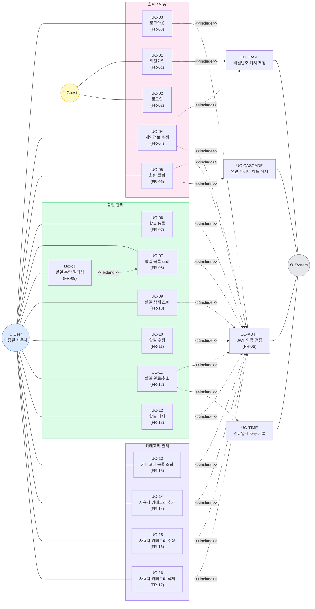

# Use Case Diagram — TodoListApp

> **버전:** 1.0
> **작성일:** 2026-05-13
> **기반 문서:** 2-prd.md v1.0
> **상태:** 초안

---

## 1. 액터 (Actors)

| 액터 | 설명 |
|------|------|
| **Guest** (비로그인 사용자) | 회원가입 및 로그인이 가능한 익명 사용자 |
| **User** (인증된 사용자) | 로그인하여 자신의 할일과 카테고리를 관리하는 사용자. Guest를 상속 |
| **System** (보조 액터) | 자동 시간 기록, 인증 검증 등 시스템 자동 처리 주체 |

---

## 2. Use Case Diagram

---

## 3. Use Case 상세 매핑

### 3.1 회원 / 인증

| UC ID | 명칭 | 액터 | FR | 관련 BR |
|-------|------|------|-----|---------|
| UC-01 | 회원가입 | Guest | FR-01 | BR-U1, BR-U2 |
| UC-02 | 로그인 | Guest | FR-02 | BR-U2 |
| UC-03 | 로그아웃 | User | FR-03 | — |
| UC-04 | 개인정보 수정 | User | FR-04 | BR-U2 |
| UC-05 | 회원 탈퇴 | User | FR-05 | BR-U3 |

### 3.2 할일 관리

| UC ID | 명칭 | 액터 | FR | 관련 BR |
|-------|------|------|-----|---------|
| UC-06 | 할일 등록 | User | FR-07 | BR-T1, BR-T2, BR-T5 |
| UC-07 | 할일 목록 조회 | User | FR-08 | BR-T1, BR-U3 |
| UC-08 | 할일 복합 필터링 | User | FR-09 | BR-U3 |
| UC-09 | 할일 상세 조회 | User | FR-10 | BR-U3 |
| UC-10 | 할일 수정 | User | FR-11 | BR-T4 |
| UC-11 | 할일 완료/취소 | User | FR-12 | BR-T3 |
| UC-12 | 할일 삭제 | User | FR-13 | BR-U3 |

### 3.3 카테고리 관리

| UC ID | 명칭 | 액터 | FR | 관련 BR |
|-------|------|------|-----|---------|
| UC-13 | 카테고리 목록 조회 | User | FR-15 | BR-C1, BR-C2 |
| UC-14 | 사용자 카테고리 추가 | User | FR-14 | BR-C3 |
| UC-15 | 사용자 카테고리 수정 | User | FR-16 | BR-C1, BR-C3 |
| UC-16 | 사용자 카테고리 삭제 | User | FR-17 | BR-C1, BR-C3, BR-C4 |

### 3.4 시스템 보조 Use Case (`<<include>>` / `<<extend>>`)

| UC ID | 명칭 | 관계 | 호출 주체 |
|-------|------|------|----------|
| UC-AUTH | JWT 인증 검증 | `<<include>>` | UC-03~UC-16 (모든 User 유스케이스) |
| UC-HASH | 비밀번호 해시 저장 | `<<include>>` | UC-01, UC-04 |
| UC-TIME | 완료일시 자동 기록 | `<<include>>` | UC-11 |
| UC-CASCADE | 연관 데이터 하드 삭제 | `<<include>>` | UC-05 |
| UC-08 | 복합 필터링 | `<<extend>>` UC-07 | 사용자가 필터 적용 시 |

---

## 4. 관계 표기 범례

| 표기 | 의미 |
|------|------|
| 실선 (───) | 액터와 Use Case 간 연관 (Association) |
| `<<include>>` 점선 | Use Case가 다른 Use Case를 반드시 포함 |
| `<<extend>>` 점선 | 특정 조건에서 Use Case를 확장 |

---

*본 다이어그램은 PRD v1.0의 FR-01 ~ FR-17 및 도메인 정의서의 BR을 기반으로 작성되었다. PRD 또는 도메인 정의서 변경 시 본 문서도 함께 갱신한다.*
